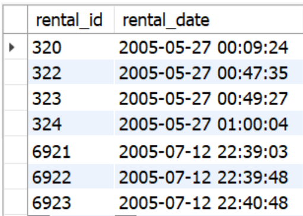

# Filtrando dados de forma específica

## TRADUÇÃO PRO INGLÊS EM CONSTRUÇÃO :construction:

- Filtrar resultados de consultas com o `WHERE`.
- Utilizar operadores booleanos e relacionais em consultas.
- Criar consultas mais dinâmicas e maleáveis com `LIKE`.
- Fazer consultas que englobam uma faixa de resultados com `IN` e `BETWEEN`.
- Encontrar e separar resultados que incluem datas.

Precedência dos operadores no `WHERE`:


Sendo assim, quando se faz a seguinte query:

```sql
SELECT * FROM sakila.payment
WHERE amount = 0.99 OR amount = 2.99 AND staff_id = 2;
```
Como o operador `AND` tem preferência sobre o operador `OR`, ele é avaliado primeiro. 

Então os registros buscados são aqueles nos quais `amount = 2.99` e `staff_id = 2`. Na sequência, são buscados os registros nos quais `amount = 0.99`, independente do valor de `staff_id`. 

Os valores retornados serão os resultados dessas duas buscas. Ou seja, a query é executada como se tivesse os seguintes parênteses: `amount = 0.99 OR (amount = 2.99 AND staff_id = 2)`.

<br>

Agora, quando executar a seguinte query:

```sql
SELECT * FROM sakila.payment
WHERE (amount = 0.99 OR amount = 2.99) AND staff_id = 2;

```

Primeiramente, a expressão dentro dos parênteses é avaliada, e todos os resultados que satisfazem a condição `amount = 0.99 OR amount = 2.99` são retornados. 

Na sequência, a expressão do lado direito do `AND` é avaliada, e todos os resultados que satisfazem a condição `staff = 2` são retornados. O `AND` então compara o resultado de ambos os lados e faz com que somente os resultados que satisfazem ambas as condições sejam retornados.

<br>

## Como criar pesquisas mais dinâmicas e maleáveis usando o `LIKE`

Você está tentando se lembrar do nome de um filme a que já assistiu, mas só se lembra de que ele terminava com don no nome. Como seria possível usar o LIKE para te ajudar a encontrá-lo?

```sql
SELECT * FROM sakila.film
WHERE title LIKE '%don';
```

<br>


<br>

O `LIKE` é usado para buscar por meio de uma sequência específica de caracteres, como no exemplo acima. Além disso, dois "**coringas**", ou *modificadores*, são normalmente usados com o `LIKE`:

**%** - O sinal de percentual, que pode representar zero, um ou múltiplos caracteres
**_** - O underscore (às vezes chamado de underline, no Brasil), que representa um único caractere

Vamos ver abaixo como usá-los (todos podem ser verificados no banco `sakila`)

```sql
-- Encontra qualquer resultado finalizando com "don"
SELECT * FROM sakila.film
WHERE title LIKE '%don';

-- Encontra qualquer resultado iniciando com "plu"
SELECT * FROM sakila.film
WHERE title LIKE 'plu%';

-- Encontra qualquer resultado que contém "plu"
SELECT * FROM sakila.film
WHERE title LIKE '%plu%';

-- Encontra qualquer resultado que inicia com "p" e finaliza com "r"
SELECT * FROM sakila.film
WHERE title LIKE 'p%r';

-- Encontra qualquer resultado em que o segundo caractere da frase é "C"
SELECT * FROM sakila.film
WHERE title LIKE '_C%';

-- Encontra qualquer resultado em que o título possui exatamente 8 caracteres
SELECT * FROM sakila.film
WHERE title LIKE '________';

-- Encontra todas as palavras com no mínimo 3 caracteres e que iniciam com E
SELECT * FROM sakila.film
WHERE title LIKE 'E__%';
```

<br>

## Englobando uma faixa de resultados com `IN` e `BETWEEN`

### Operador `IN`
É possível juntar várias condições nas suas *queries* usando os operadores **AND** e **OR**. 
No entanto, você ainda terá que digitar cada condição separadamente, como no exemplo a seguir:

```sql
SELECT * FROM sakila.actor
WHERE first_name = 'PENELOPE'
  OR first_name = 'NICK'
  OR first_name = 'ED'
  OR first_name = 'JENNIFER';
```

Uma forma melhor de fazer essa mesma pesquisa seria usando o `IN`:
```sql
SELECT * FROM sakila.actor
WHERE first_name 
  IN ('PENELOPE','NICK','ED','JENNIFER');
```


<br>

Podemos fazer esse mesmo processo para números também:
```sql
SELECT * FROM sakila.customer
WHERE customer_id in (1, 2, 3, 4, 5);
```


<br>

Para realizar pesquisas utilizando o `IN`, a sintaxe a ser usada é a seguinte:

```sql
SELECT * FROM banco_de_dados
WHERE coluna 
  IN (valor1, valor2, valor3, valor4, ..., valorN);

-- ou também
SELECT * FROM banco_de_dados
WHERE coluna 
  IN (expressão);
```

<br>

### Operador `BETWEEN`
Uma outra opção quando queremos trabalhar com faixas de resultados é o `BETWEEN`, que torna possível fazer pesquisas dentro de uma faixa inicial e final.

```sql
expressão BETWEEN valor1 AND valor2;
-- a expressão é a sua query
-- e valor1 e valor2 delimitam o resultado
```

Então, quando você faz uma *query* como essa, você terá o resultado da imagem a seguir:

```sql
-- Note que o MySQL inclui o valor inicial e o final nos resultados
SELECT title, length FROM sakila.film
WHERE length 
  BETWEEN 50 AND 120;
```


<br>

### Usando o `BETWEEN` com strings
Para encontrar uma faixa de valores em que os valores são strings, podemos digitar a palavra por completo para encontrar os valores. 
Exemplo:

```sql
SELECT * FROM sakila.language
WHERE name 
  BETWEEN 'Italian' AND 'Mandarin'
ORDER BY name;
```

<br>

### Usando o `BETWEEN` com datas
Para usar o **BETWEEN** com datas, basta que você digite o valor no formato padrão da data, que é **YYYY-MM-DD HH:MM:SS** , sendo os valores de horas, minutos e segundos opcionais. No exemplo abaixo, estamos filtrando os resultados para exibir o `rental_id` e `rental_date` apenas entre o mês 05 e o mês 07:

```sql
SELECT rental_id, rental_date FROM sakila.rental
WHERE rental_date
  BETWEEN '2005-05-27' AND '2005-07-17';
```



<br>

### Encontrando e separando resultados que incluem datas
No MySQL, o tipo `DATE` faz parte dos [tipos de dados](https://www.mysqltutorial.org/mysql-data-types.aspx) temporais, os quais vamos ver com mais detalhes no decorrer do curso. 

O MySQL, por padrão, usa o formato **YYYY-MM-DD** (ano/mês/dia) ao armazenar os valores de uma data. Você é obrigado, pelo banco de dados, a salvar nesse formato, e não é possível alterá-lo. Temos também o tipo `DATETIME`, que inclui informações de tempo. Vamos ver dois tipos comuns a seguir:

- `DATE` - Possui apenas data, no formato `YYYY-MM-DD` na faixa de 1001-01-01 até 9999-12-31

- `DATETIME` - Possui data e tempo, no formato `YYYY-MM-DD HH:MM:SS` com a faixa de **1000-01-01 00:00:00** até **9999-12-31 23:59:59**.

Se você pesquisar agora no banco `sakila` usando a seguinte *query*:
```sql
SELECT * FROM sakila.payment;
```


É possível confirmar que a coluna `payment_date` é exibida no formato `YYYY-MM-DD HH:MM:SS`. Assim, para fazer pesquisas e filtrar dados baseados em datas, temos que ter sempre isso em mente: quando você pensar no dia de **25 de dezembro de 2020**, para o banco dados, esse dia será **2020-12-25**.

<br>

### Maneiras de encontrar dados por data
Vamos dizer que queremos encontrar pagamentos realizados na data 2005-07-31 na tabela sakila.payment . Há várias formas de fazer isso.

#### Usando a função `DATE(coluna_do_tipo_date)`:

```sql
-- Encontra todos os pagamentos deste dia, ignorando horas, minutos e segundos
SELECT * FROM sakila.payment
WHERE DATE(payment_date) = '2005-07-31';
```

#### Usando `LIKE` para valores aproximados:
```sql
-- Encontra todos pagamentos deste dia, ignorando horas, minutos e segundos
SELECT * FROM sakila.payment
WHERE payment_date 
  LIKE '2005-07-31%';

-- Encontra um pagamento com dia e hora exatos
SELECT * FROM sakila.payment
WHERE payment_date 
  LIKE '2005-08-20 00:30:52';
```

#### Usando `BETWEEN`:
```sql
-- Encontra pagamentos especificando um valor mínimo e um valor máximo para a data
SELECT * FROM sakila.payment
WHERE payment_date 
  BETWEEN '2005-05-26 00:00:00' AND '2005-05-27 23:59:59';
```

### Selecionando apenas partes de uma data
Às vezes você está interessado em apenas uma parte de uma data, como o ano ou as horas. MySQL possui funções que retornam partes específicas de uma data ou hora.

```sql
-- Teste cada um dos comandos a seguir:
SELECT DATE(payment_date) FROM sakila.payment; -- YYYY-MM-DD
SELECT YEAR(payment_date) FROM sakila.payment; -- Ano
SELECT MONTH(payment_date) FROM sakila.payment; -- Mês
SELECT DAY(payment_date) FROM sakila.payment; -- Dia
SELECT HOUR(payment_date) FROM sakila.payment; -- Hora
SELECT MINUTE(payment_date) FROM sakila.payment; -- Minuto
SELECT SECOND(payment_date) FROM sakila.payment; -- Segundo
```

<br>

# EXERCÍCIOS

#### [Part 1] Entre no banco de dados `sakila` e siga as instruções:

Guia de como a **classificação indicativa** é usada no banco de dados `sakila`. 
Consulte-a ao fazer os exercícios propostos.

 | CLASSIFICAÇÃO | LEGENDA | 
 |:-------------:|:-------------:|
 | **G** | permitido para todos | 
 | **PG** | permitido para crianças menores de 13 anos | 
 | **PG-13** | permitido para pessoas com mais de 13 anos | 
 | **R** | permitido para pessoas com mais de 17 anos | 
 | **NC-17** | permitido apenas para adultos | 

1. Precisamos identificar os dados do cliente com o e-mail `LEONARD.SCHOFIELD@sakilacustomer.org`.

2. Precisamos de um relatório dos nomes dos clientes, em **ordem alfabética**, que não estão mais ativos no nosso sistema e pertencem à loja com o `id = 2`, e não inclua o cliente `KENNETH` no resultado.

3. O setor financeiro quer saber título, descrição, ano de lançamento e valor do custo de substituição ( replacement_cost ), dos 100 filmes com o maior custo de substituição, do valor mais alto ao mais baixo, entre os filmes feitos para menores de idade e que têm o custo mínimo de substituição de $18,00 dólares. Em caso de empate, ordene em **ordem alfabética** pelo título.

4. Quantos clientes estão **ativos** na loja `1`?

5. Mostre todos os detalhes dos clientes que **não** estão ativos na loja `1`.

6. Precisamos descobrir quais são os 50 filmes feitos apenas para adultos com a **menor** taxa de aluguel, para que possamos fazer uma divulgação melhor desses filmes. Em caso de empate, ordene em **ordem alfabética** pelo título.

<br>

#### [Part 2] Tente encontrar as seguintes informações:
1. Mostre todos os detalhes dos filmes que contêm a palavra ace no nome.

2. Mostre todos os detalhes dos filmes cujas descrições finalizam com china .

3. Mostre todos os detalhes dos dois filmes cujas descrições contêm a palavra girl e o título finaliza com a palavra lord .

4. Mostre os dois casos em que, a partir do 4° caractere no título do filme, tem-se a palavra gon .

5. Mostre o único caso em que, a partir do 4° caractere no título do filme, tem-se a palavra gon e a descrição contém a palavra `Documentary`.

6. Mostre os dois filmes cujos títulos ou finalizam com academy ou iniciam com mosquito .

7. Mostre os seis filmes que contêm as palavras monkey e sumo em suas descrições.

<br>

#### [Part 3] 
1. Mostre o nome, sobrenome e e-mail dos clientes com os seguintes sobrenomes: **hicks**, **crawford**, **henry**, **boyd**, **mason**, **morales** e **kennedy** , ordenados por nome em **ordem alfabética**.

2. Mostre o e-mail dos clientes com os `address_id` **172**, **173**, **174**, **175** e **176**, ordenados em **ordem alfabética**.

3. Descubra quantos pagamentos foram feitos entre **01/05/2005** e **01/08/2005**. Lembre-se de que, no banco de dados, as datas estão armazenadas no formato **ano/mês/dia**, diferente do formato brasileiro, que é **dia/mês/ano**.

4. Mostre o **título**, **ano de lançamento** e **duração do empréstimo** de todos os **filmes** com a duração de empréstimo de 3 a 6. Os resultados devem ser classificados em filmes com **maior duração** de empréstimo primeiro. Em caso de empate, ordene em **ordem alfabética** pelo título.

5. Monte um relatório que exiba o **título** e **classificação** dos **500 primeiros filmes** direcionados para as classificações indicativas **G, PG e PG-13**. Os resultados devem estar ordenados por título.


<br>

#### [Part 4]
1. Quantos pagamentos temos com a data de retorno **2005-05-25**? Há múltiplas maneiras possíveis de encontrar a resposta.

2. Quantos pagamentos foram feitos entre **01/07/2005 e 22/08/2005**?

3. Usando a tabela `rental`, extraia **data**, **ano**, **mês**, **dia**, **hora**, **minuto** e **segundo** dos registros com `rental_id = 10330`. Utilize a coluna `rental_date` para extrair as informações.

4. Monte uma *query* que retorne todos os dados do pagamento feito no dia **28/07/2005** a partir das **22 horas**.


<br>

#### [Part 5] Para realizar as tarefas a seguir, restaure o seguinte banco de dados:
```sql
DROP SCHEMA IF EXISTS PecasFornecedores;
CREATE SCHEMA PecasFornecedores;
USE PecasFornecedores;

CREATE TABLE Pecas (
  code INTEGER PRIMARY KEY NOT NULL,
  name TEXT NOT NULL
);

CREATE TABLE Fornecedores (
  code VARCHAR(40) PRIMARY KEY NOT NULL,
  name TEXT NOT NULL
);

CREATE TABLE Fornecimentos (
  code INTEGER PRIMARY KEY NOT NULL AUTO_INCREMENT,
  peca INTEGER,
  FOREIGN KEY (peca) REFERENCES Pecas (code),
  Fornecedor VARCHAR(40),
  FOREIGN KEY (fornecedor) REFERENCES Fornecedores (code),
  Preco INTEGER NOT NULL
);

CREATE TABLE Vendas (
  code INTEGER NOT NULL AUTO_INCREMENT PRIMARY KEY,
  fornecimento INTEGER,
  quantity INTEGER,
  order_date DATETIME,
  FOREIGN KEY (fornecimento) REFERENCES Fornecimentos (code)
);

INSERT INTO Fornecedores(code, name)
  VALUES ('ROB', 'Robauto SA'),
    ('CNF', 'Confiauto LTDA'),
    ('MAP', 'Malok Auto Peças'),
    ('INF', 'Infinity Peças LTDA');

INSERT INTO Pecas(code, name)
  VALUES (1, 'Rebimboca'),
    (2, 'Parafuseta'),
    (3, 'Grampola'),
    (4, 'Grapeta');

INSERT INTO Fornecimentos(peca, fornecedor, preco)
  VALUES (1, 'CNF', 10),
    (1, 'ROB', 15),
    (2, 'CNF', 20),
    (2, 'ROB', 25),
    (2, 'MAP', 14),
    (3, 'INF', 50),
    (3, 'MAP', 45),
    (4, 'CNF', 5),
    (4, 'ROB', 7);

INSERT INTO Vendas(fornecimento, quantity, order_date)
  VALUES (1, 3, '2017-05-22 11:28:36'),
    (2, 2, '2018-03-22 11:35:24'),
    (3, 8, '2018-11-16 15:51:36'),
    (3, 10, '2019-02-13 13:23:22'),
    (8, 5, '2019-06-11 12:22:48'),
    (6, 1, '2019-09-07 09:53:58'),
    (7, 3, '2020-01-05 08:39:33'),
    (9, 5, '2020-05-13 14:05:19');
```

1. Escreva uma query para exibir todas as peças que começam com **GR**.

2. Escreva uma query para exibir todos os fornecimentos que contenham a peça com code `2`. Organize o resultado por **ordem alfabética** de **fornecedor**.

3. Escreva uma query para exibir as **peças**, **preço** e **fornecedor** de todos os fornecimentos em que o código do fornecedor tenha a letra `N`.

4. Escreva uma query para exibir todas as informações dos fornecedores que são empresas limitadas (LTDA). Ordene os resultados em **ordem alfabética decrescente**.

5. Escreva uma query para exibir o número de empresas (fornecedores) que contém a letra `F` no código.

6. Escreva uma query para exibir os fornecimentos onde as peças custam mais de **R$15,00** e menos de **$40,00**. Ordene os resultados por **ordem crescente**.

7. Escreva uma query para exibir o número de vendas feitas entre o dia **15/04/2018** e o dia **30/07/2019** .


<br>

#### [Part 6] Usando o banco de dados `Scientists` restaurado no dia anterior (diretório 20.2), realize os exercícios a seguir. Caso ainda não tenha restaurado o banco, utilize o código abaixo para fazê-lo.
```sql
DROP SCHEMA IF EXISTS Scientists;
CREATE SCHEMA Scientists;
USE Scientists;

CREATE TABLE Scientists (
  SSN INT,
  Name CHAR(30) NOT NULL,
  PRIMARY KEY (SSN)
);

CREATE TABLE Projects (
  Code CHAR(4),
  Name CHAR(50) NOT NULL,
  Hours INT,
  PRIMARY KEY (Code)
);

CREATE TABLE AssignedTo (
  Scientist INT NOT NULL,
  Project CHAR(4) NOT NULL,
  PRIMARY KEY (Scientist, Project),
  FOREIGN KEY (Scientist) REFERENCES Scientists (SSN),
  FOREIGN KEY (Project) REFERENCES Projects (Code)
);

INSERT INTO Scientists(SSN, Name)
  VALUES(123234877, 'Michael Rogers'),
    (152934485, 'Anand Manikutty'),
    (222364883, 'Carol Smith'),
    (326587417, 'Joe Stevens'),
    (332154719, 'Mary-Anne Foster'),
    (332569843, 'George ODonnell'),
    (546523478, 'John Doe'),
    (631231482, 'David Smith'),
    (654873219, 'Zacary Efron'),
    (745685214, 'Eric Goldsmith'),
    (845657245, 'Elizabeth Doe'),
    (845657246, 'Kumar Swamy');

 INSERT INTO Projects (Code, Name, Hours)
  VALUES ('AeH1' ,'Winds: Studying Bernoullis Principle', 156),
    ('AeH2', 'Aerodynamics and Bridge Design', 189),
    ('AeH3', 'Aerodynamics and Gas Mileage', 256),
    ('AeH4', 'Aerodynamics and Ice Hockey', 789),
    ('AeH5', 'Aerodynamics of a Football', 98),
    ('AeH6', 'Aerodynamics of Air Hockey', 89),
    ('Ast1', 'A Matter of Time', 112),
    ('Ast2', 'A Puzzling Parallax', 299),
    ('Ast3', 'Build Your Own Telescope', 6546),
    ('Bte1', 'Juicy: Extracting Apple Juice with Pectinase', 321),
    ('Bte2', 'A Magnetic Primer Designer', 9684),
    ('Bte3', 'Bacterial Transformation Efficiency', 321),
    ('Che1', 'A Silver-Cleaning Battery', 545),
    ('Che2', 'A Soluble Separation Solution', 778);

 INSERT INTO AssignedTo (Scientist, Project)
  VALUES (123234877, 'AeH1'),
    (152934485, 'AeH3'),
    (222364883, 'Ast3'),
    (326587417, 'Ast3'),
    (332154719, 'Bte1'),
    (546523478, 'Che1'),
    (631231482, 'Ast3'),
    (654873219, 'Che1'),
    (745685214, 'AeH3'),
    (845657245, 'Ast1'),
    (845657246, 'Ast2'),
    (332569843, 'AeH4');
```

1. Escreva uma query para exibir todas as informações de todos os cientistas que possuam a letra `E` em seu nome.

2. Escreva uma query para exibir o nome de todos os projetos cujo o código inicie com a letra `A`. Ordene o resultado em **ordem alfabética**.

3. Escreva uma query para exibir o código e nome de todos os projetos que possuam em seu código o número 3 . Ordene o resultado em **ordem alfabética**.

4. Escreva uma query para exibir todos os cientistas (valores numéricos) cujos projetos sejam **AeH3** , **Ast3** ou **Che1**.

5. Escreva uma query para exibir todas as informações de todos os projetos com mais de 500 horas.

6. Escreva uma query para exibir todas as informações de todos os projetos cujas horas sejam maiores que 250 e menores 800.

7. Escreva uma query para exibir o **nome** e o **código** de todos os projetos cujo nome NÃO inicie com a letra `A`.

8. Escreva uma query para exibir o nome de todos os projetos cujo código contenha a letra `H`.
