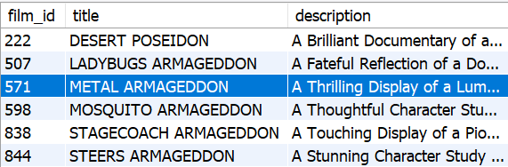

# Filtrando dados de forma específica

### TRADUÇÃO PRO INGLÊS EM CONSTRUÇÃO :construction:

- Filtrar resultados de consultas com o `WHERE`.
- Utilizar operadores booleanos e relacionais em consultas.
- Criar consultas mais dinâmicas e maleáveis com `LIKE`.
- Fazer consultas que englobam uma faixa de resultados com `IN` e `BETWEEN`.
- Encontrar e separar resultados que incluem datas.

Precedência dos operadores no `WHERE`:


Sendo assim, quando se faz a seguinte query:

```sql
SELECT * FROM sakila.payment
WHERE amount = 0.99 OR amount = 2.99 AND staff_id = 2;
```
Como o operador `AND` tem preferência sobre o operador `OR`, ele é avaliado primeiro. 

Então os registros buscados são aqueles nos quais `amount = 2.99` e `staff_id = 2`. Na sequência, são buscados os registros nos quais `amount = 0.99`, independente do valor de `staff_id`. 

Os valores retornados serão os resultados dessas duas buscas. Ou seja, a query é executada como se tivesse os seguintes parênteses: `amount = 0.99 OR (amount = 2.99 AND staff_id = 2)`.

<br>

Agora, quando executar a seguinte query:

```sql
SELECT * FROM sakila.payment
WHERE (amount = 0.99 OR amount = 2.99) AND staff_id = 2;

```

Primeiramente, a expressão dentro dos parênteses é avaliada, e todos os resultados que satisfazem a condição `amount = 0.99 OR amount = 2.99` são retornados. 

Na sequência, a expressão do lado direito do `AND` é avaliada, e todos os resultados que satisfazem a condição `staff = 2` são retornados. O `AND` então compara o resultado de ambos os lados e faz com que somente os resultados que satisfazem ambas as condições sejam retornados.

<br>

### Como criar pesquisas mais dinâmicas e maleáveis usando o `LIKE`

Você está tentando se lembrar do nome de um filme a que já assistiu, mas só se lembra de que ele terminava com don no nome. Como seria possível usar o LIKE para te ajudar a encontrá-lo?

```sql
SELECT * FROM sakila.film
WHERE title LIKE '%don';
```


O `LIKE` é usado para buscar por meio de uma sequência específica de caracteres, como no exemplo acima. Além disso, dois "**coringas**", ou *modificadores*, são normalmente usados com o `LIKE`:

**%** - O sinal de percentual, que pode representar zero, um ou múltiplos caracteres
**_** - O underscore (às vezes chamado de underline, no Brasil), que representa um único caractere

Vamos ver abaixo como usá-los (todos podem ser verificados no banco `sakila`)

```sql
-- Encontra qualquer resultado finalizando com "don"
SELECT * FROM sakila.film
WHERE title LIKE '%don';

-- Encontra qualquer resultado iniciando com "plu"
SELECT * FROM sakila.film
WHERE title LIKE 'plu%';

-- Encontra qualquer resultado que contém "plu"
SELECT * FROM sakila.film
WHERE title LIKE '%plu%';

-- Encontra qualquer resultado que inicia com "p" e finaliza com "r"
SELECT * FROM sakila.film
WHERE title LIKE 'p%r';

-- Encontra qualquer resultado em que o segundo caractere da frase é "C"
SELECT * FROM sakila.film
WHERE title LIKE '_C%';

-- Encontra qualquer resultado em que o título possui exatamente 8 caracteres
SELECT * FROM sakila.film
WHERE title LIKE '________';

-- Encontra todas as palavras com no mínimo 3 caracteres e que iniciam com E
SELECT * FROM sakila.film
WHERE title LIKE 'E__%';
```

<br>
# EXERCICIOS

#### [Part 1] Entre no banco de dados `sakila` e siga as instruções:

Guia de como a **classificação indicativa** é usada no banco de dados `sakila`. Consulte-a ao fazer os desafios propostos.
 | CLASSIFICAÇÃO | LEGENDA | 
 |:-------------:||:-------------:|
 | **G** | permitido para todos | 
 | **PG** | permitido para crianças menores de 13 anos | 
 | **PG-13** | permitido para pessoas com mais de 13 anos | 
 | **R** | permitido para pessoas com mais de 17 anos | 
 | **NC-17** | permitido apenas para adultos | 

1. Precisamos identificar os dados do cliente com o e-mail `LEONARD.SCHOFIELD@sakilacustomer.org`.
2. Precisamos de um relatório dos nomes dos clientes, em **ordem alfabética**, que não estão mais ativos no nosso sistema e pertencem à loja com o `id = 2`, e não inclua o cliente `KENNETH` no resultado.
3. O setor financeiro quer saber título, descrição, ano de lançamento e valor do custo de substituição ( replacement_cost ), dos 100 filmes com o maior custo de substituição, do valor mais alto ao mais baixo, entre os filmes feitos para menores de idade e que têm o custo mínimo de substituição de $18,00 dólares. Em caso de empate, ordene em **ordem alfabética** pelo título.
4. Quantos clientes estão **ativos** na loja `1`?
5. Mostre todos os detalhes dos clientes que **não** estão ativos na loja `1`.
6. Precisamos descobrir quais são os 50 filmes feitos apenas para adultos com a **menor** taxa de aluguel, para que possamos fazer uma divulgação melhor desses filmes. Em caso de empate, ordene em **ordem alfabética** pelo título.

<br>

#### [Part 2] Tente encontrar as seguintes informações:
1. Mostre todos os detalhes dos filmes que contêm a palavra ace no nome.

2. Mostre todos os detalhes dos filmes cujas descrições finalizam com china .

3. Mostre todos os detalhes dos dois filmes cujas descrições contêm a palavra girl e o título finaliza com a palavra lord .

4. Mostre os dois casos em que, a partir do 4° caractere no título do filme, tem-se a palavra gon .

5. Mostre o único caso em que, a partir do 4° caractere no título do filme, tem-se a palavra gon e a descrição contém a palavra `Documentary`.

6. Mostre os dois filmes cujos títulos ou finalizam com academy ou iniciam com mosquito .


7. Mostre os seis filmes que contêm as palavras monkey e sumo em suas descrições.

<br>

#### [Part 3] 
1. 
2. 
3. 

<br>

#### [Part 4]
1. 
2. 
3. 
4. 
5. 
6. 

<br>

#### [Part 5]
1. 
2. 
3. 
4. 
5. 
6. 

<br>

#### [Part 6]
1. 
2. 
3. 
4. 
5. 
6. 

<br>

#### [Part 7]
1. 
2. 
3. 
4. 
5. 
6. 

<br>

#### [Part 8] 
1. 
2. 
3. 
4. 
5. 
6. 

<br>

#### [Part 9] 

```sql

```

1. 
2. 
3. 
4. 
5. 
6. 
