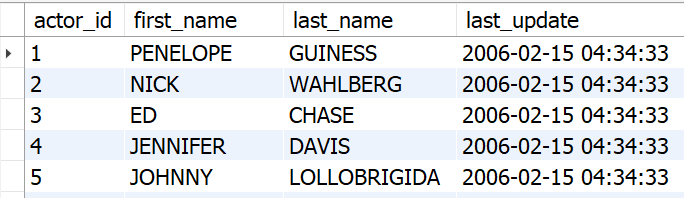
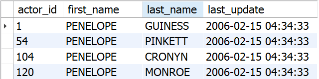
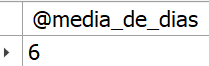
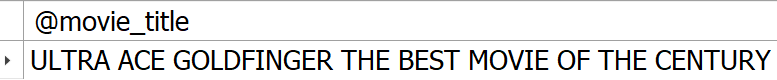
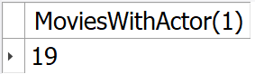
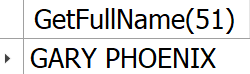
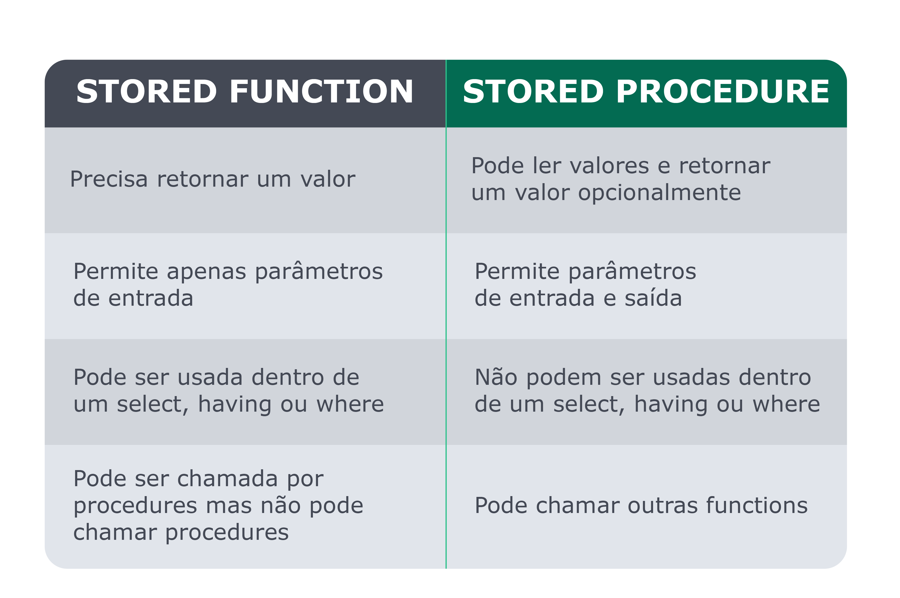
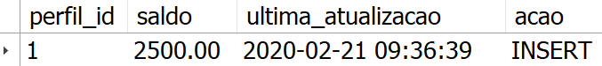
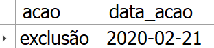

# Stored Routines & Stored Functions


> :warning: Translation to **English** under construction :construction:

- Criar blocos de código SQL reutilizáveis com `STORED PROCEDURES` e `STORED FUNCTIONS`;
- Criar reações dinâmicas com `TRIGGERS`.

As `STORED PROCEDURES` e `STORED FUNCTIONS` podem te ajudar a seguir um conceito de programação chamado [DRY](https://pt.wikipedia.org/wiki/Don%27t_repeat_yourself), que preza pela redução de código repetido, quando possível.

Isso é viabilizado pelo fato de esses comandos te permitirem criar blocos de código SQL reutilizáveis, que podem se comunicar com outros frameworks e linguagens de programação, como Node.js, C#, Python, Java e PHP, entre outras.

<br>

# Estrutura padrão de uma stored procedure

```sql
USE banco_de_dados; -- obrigatório para criar a procedure no banco correto
DELIMITER $$ -- definindo delimitador

CREATE PROCEDURE nome_da_procedure(@parametro1, @parametro2, ..., @parametroN) -- parâmetros
BEGIN -- delimitando o início do código SQL

END $$ -- delimitando o final do código SQL

DELIMITER ; -- muda o delimitador de volta para ; - o espaço entre DELIMITER e o ';' é necessário
```

**Procedure sem parâmetros:**

Normalmente é utilizada para realizar queries mais simples.

**Exemplo:** Aqui estamos apenas executando uma busca na tabela actor e exibindo os resultados.

```sql
USE sakila;
DELIMITER $$

CREATE PROCEDURE ShowAllActors()
BEGIN
    SELECT * FROM sakila.actor;
END $$

DELIMITER ;

-- Como usar:
CALL ShowAllActors();
```



<br>

# Elementos das Stored Procedures

Verifique os elementos de uma stored procedures no passo a passo a seguir:
1 - Delimiter
A palavra-chave DELIMITER é usada para definir qual símbolo representa o final da procedure declarada. Aqui estamos usando $$ , porém é permitido usar outros símbolos como // ou até mesmo ; para retornar ao DELIMITER como padrão default. Atenção, não é permitido usar \ , pois é um caractere especial do MySQL.
O DELIMITER precisa ser usado para que o MySQL não interprete o primeiro ponto e vírgula encontrado como o final da declaração na sua procedure.
2 - Variáveis
O MySQL possui a funcionalidade de criar e usar variáveis, assim como em outras linguagens de programação. Essas variáveis também podem ser usadas em procedures .
No MySQL existem três principais tipos de variáveis, sendo elas:
User-defined variables;
Local Variables;
Server System Variables.
Não abordaremos todas elas, mas se quiser aprofundar em alguma delas consulte nossos recursos adicionais.
A forma mais comum é por meio da User-defined variables que para criar variáveis e atribuir valores a elas, você pode fazer da seguinte maneira:


```sql
SET @my_school = 'BeTrybe';

SELECT @my_school;
```

3 - Tipos de dados
Existem vários tipos de dados no MySQL que vão além de apenas numéricos e strings. É relevante que você tenha uma noção básica, sabendo que esses tipos no MySQL são determinados por meio de algumas características:
- Tipo de valor que representa;
- O espaço ocupado e se possui comprimento fixo ou variável;
- Se os valores podem ser indexados ou não;
- Comparação de valores de um tipo de dado específico pelo MySQL .

Os principais tipos de dados do MySQL são:
**Tipos de String**
- VARCHAR : Uma string não binária de comprimento variável;
- CHAR : Uma string não binária (caractere) de comprimento fixo;
- TEXT : Uma pequena string não binária.

**Tipos Numéricos**
- TYNINT : Um número inteiro muito pequeno;
- INT : Um inteiro padrão;
- BIGINT : Um grande número inteiro;
- DECIMAL : Um número de ponto fixo.

<br>

# Construindo sua primeira stored procedure

Vamos criar nossas primeiras stored procedures . Temos os seguintes tipos:
- Procedure sem parâmetros;
- Procedure com parâmetros de entrada (IN) ;
- Procedure com parâmetros de saída (OUT) ;
- Procedure com parâmetros de entrada e saída (IN-OUT) .

**Procedure com parâmetros de entrada (IN):**
Para criar procedures com funcionalidades mais elaboradas, podemos passar parâmetros de entrada. Ao definir um parâmetro do tipo IN , podemos usá-lo e modificá-lo dentro da nossa procedure.

**Exemplo:** Foi criada uma procedure que recebe como parâmetro uma sílaba (syllable) e busca na tabela actor todos atores quem contêm aquela sílaba no nome.

```sql
USE sakila;
DELIMITER $$

CREATE PROCEDURE ShowActorsWithSyllable(IN syllable VARCHAR(100))
BEGIN
    SELECT *
    FROM sakila.actor
    WHERE first_name LIKE CONCAT('%', syllable, '%');
END $$

DELIMITER ;

-- Como usar:
CALL ShowActorsWithSyllable('lope');
```



<br>


**Procedure com parâmetros de saida (OUT):**
O parâmetro `OUT` é útil quando você precisa que algo seja avaliado ou encontrado dentro de uma query e te retorne esse valor para que algo adicional possa ser feito com ele.

**Exemplo:** Estamos recebendo aqui o título de um filme como valor de entrada e depois buscando dentro da procedure a duração média de um empréstimo daquele filme. Feito isso, ele é inserido em uma variável que pode ser usada posteriormente.

```sql
USE sakila;
DELIMITER $$

CREATE PROCEDURE ShowAverageRentalDurationOfMovie(
    IN film_name VARCHAR(300),
    OUT media_aluguel_em_dias DOUBLE
)
BEGIN
    SELECT AVG(rental_duration) INTO media_aluguel_em_dias
    FROM sakila.film
    WHERE title = film_name;
END $$

DELIMITER ;

-- Como usar:

CALL ShowAverageRentalDurationOfMovie('ACADEMY DINOSAUR', @media_de_dias);
SELECT @media_de_dias;
```



<br>

**Procedure com parâmetros de entrada-saida (IN-OUT):**
O `IN-OUT` deve ser usado quando é necessário que um parâmetro possa ser modificado tanto antes como durante a execução de uma procedure.

**Exemplo:** Estamos gerando um novo nome para um filme, usando como base a variável film_name , que deve ser criada e passada como parâmetro para a procedure. O parâmetro sofrerá alterações dentro da procedure, podendo ser usado posteriormente com o novo nome.

```sql
USE sakila;
DELIMITER $$

CREATE PROCEDURE NameGenerator(INOUT film_name VARCHAR(300))
BEGIN
    SELECT CONCAT('ULTRA ', film_name, ' THE BEST MOVIE OF THE CENTURY')
    INTO film_name;
END $$

DELIMITER ;

-- Como usar:
SELECT 'ACE GOLDFINGER' INTO @movie_title;
CALL NameGenerator(@movie_title);
SELECT @movie_title;
```



<br>

# Stored Functions
Na área de programação, temos uma boa prática chamada [DRY (Don't Repeat Yourself)](http://www.macoratti.net/16/04/net_dry1.htm) que, em resumo, sugere que você não se repita ou reescreva o mesmo código várias vezes.

Nesse ponto, temos uma das principais ferramentas para combater esse problema no SQL: as `stored functions`.

Através delas, podemos encapsular nossas queries usadas mais frequentemente dentro de um bloco de código nomeado e parametrizável.

**Sua primeira stored function**
Stored functions podem ser executadas com o comando SELECT . Ao criá-las, temos que definir o tipo de retorno que sua função possui.

**Tipos de retorno comuns:**
- `DETERMINISTIC` - Sempre retorna o mesmo valor ao receber os mesmos dados de entrada;
- `READS SQL DATA` - Indica para o MySQL que sua função somente lerá dados.

Em muitas situações, sua function estará apenas lendo e retornando dados. Nesses casos, a opção READS SQL DATA deve ser usada. No entanto, sempre avalie o tipo mais adequado à sua função.

**Estrutura padrão de uma stored function**
```sql
USE banco_de_dados; -- obrigatório para criar a função no banco correto
DELIMITER $$

CREATE FUNCTION nome_da_function(parametro1, parametro2, ..., parametroN)
RETURNS tipo_de_dado tipo_de_retorno
BEGIN
    query_sql
    RETURN resultado_a_ser_retornado;
END $$

DELIMITER ;
```

**Exemplo:** Uma stored function que exibe a quantidade de filmes em que um determinado ator ou atriz atuou:

```sql
USE sakila;
DELIMITER $$

CREATE FUNCTION MoviesWithActor(actor_id int)
RETURNS INT READS SQL DATA
BEGIN
    DECLARE movie_total INT;
    SELECT COUNT(*)
    FROM sakila.film_actor
    WHERE sakila.film_actor.actor_id = actor_id INTO movie_total;
    RETURN movie_total;
END $$

DELIMITER ;

-- Como usar:

SELECT MoviesWithActor(1);
```




```sql
USE sakila;
DELIMITER $$

CREATE FUNCTION GetFullName(id INT)
RETURNS VARCHAR(200) READS SQL DATA
BEGIN
    DECLARE full_name VARCHAR(200);
    SELECT concat(first_name, ' ', last_name)
    FROM sakila.actor
    WHERE actor_id = id
    LIMIT 1
    INTO full_name ;
    RETURN full_name;
END $$

DELIMITER ;

SELECT GetFullName(51);
```



Assim como no caso das fuções de agregação AVG , MIN , MAX e SUM , entre outras, as stored functions são extremamente úteis e devem ser criadas sempre que percebermos que o mesmo tipo de código está sendo repetido em vários lugares diferentes.

Isso ajuda a reduzir a quantidade de duplicação de código em seu servidor de banco de dados e deixa seu código mais legível e limpo, além de contribuir para uma melhor experiência para outras pessoas desenvolvedoras que possam ter que dar manutenção no seu código.

<br>

# Stored Functions VS Store Procedures



- Stored Procedures podem ser chamadas através do comando `CALL`, e o retorno de um valor é opcional;
- Já as Stored Functions são executadas com o comando `SELECT` e obrigatoriamente retornam algum valor;
- A Stored Functions não pode ser utilizada para alterar o estado global da base dados. (Ex. Por meio das instruções `INSERT`, `UPDATE` e `DELETE`);
- Stored Procedures permite alterar o estado global.
- Stored Procedures permitem realizar o tratamento de excepções, via try/catch.

<br>

# Criando reações dinâmicas com `Triggers`

Triggers são blocos de código SQL que são disparados em reação a alguma atividade que ocorre no banco de dados. Eles podem ser disparados em dois momentos distintos, e é possível definir condições para esse disparo.

Momentos em que um trigger pode ser disparado
- BEFORE : antes que alguma ação seja executada;
- AFTER : após alguma ação já ter sido executada.

O que pode ativar um Trigger?
- INSERT ;
- UPDATE ;
- DELETE .

O que pode ser acessado dentro de um trigger?
- O valor OLD de uma coluna: valor presente em uma coluna antes de uma operação;
- O valor NEW de uma coluna: valor presente em uma coluna após uma operação.

### Em quais operações os valores OLD e NEW estão disponíveis?

| Operação |  OLD  |  NEW  |
| -------- |:-----:| -----:|
|  INSERT  | `Não` |  Sim  |
|  UPDATE  |  Sim  |  Sim  |
|  DEDLETE |  Sim  | `Não` |

<br>

**Sintaxe**

```sql
DELIMITER $$

CREATE TRIGGER nome_do_trigger
[BEFORE | AFTER] [INSERT | UPDATE | DELETE] ON tabela
FOR EACH ROW
BEGIN
    -- o código SQL entra aqui
END

DELIMITER $$ ;
```

## Exemplos das três operações

Para os próximos exemplos, considere as seguintes tabelas e banco de dados:
```sql
CREATE DATABASE IF NOT EXISTS rede_social;

USE rede_social;

CREATE TABLE perfil(
    perfil_id INT PRIMARY KEY auto_increment,
    saldo DECIMAL(10, 2) NOT NULL DEFAULT 0,
    ultima_atualizacao DATETIME,
    acao VARCHAR(50),
    ativo BOOLEAN DEFAULT 1
) engine = InnoDB;

CREATE TABLE log_perfil(
    acao_id INT PRIMARY KEY AUTO_INCREMENT,
    acao VARCHAR(300),
    data_acao DATE
) engine = InnoDB;
```

### Exemplo de trigger para o `INSERT`:

Considerando a tabela perfil , hora de montar um Trigger que define a data de inserção e o tipo de operação, quando um novo registro é inserido.
```sql
USE rede_social;

DELIMITER $$
CREATE TRIGGER trigger_perfil_insert
    BEFORE INSERT ON perfil
    FOR EACH ROW
BEGIN
    SET NEW.ultima_atualizacao = NOW(),
        NEW.acao = 'INSERT';
END $$
DELIMITER ;
```

No `trigger` acima, o valor da coluna `ultima_atualizacao` está sendo definido para a data atual com o comando `NOW()` e, na sequência, definindo o valor da coluna acao para "INSERT". A palavra-chave `NEW` é utilizada para acessar e modificar as propriedades da tabela.

Para ver o resultado do uso do `Trigger` na prática, execute o exemplo abaixo:
```sql
INSERT INTO perfil(saldo) VALUES (2500);

SELECT * FROM perfil;
```



<br>

### Exemplo de trigger para o `UPDATE`:
Considerando a tabela perfil, hora de montar um Trigger que define a data de atualização e o tipo de operação, quando algum registro for modificado.
```sql
USE rede_social;

DELIMITER $$
CREATE TRIGGER trigger_perfil_update
    BEFORE UPDATE ON perfil
    FOR EACH ROW
BEGIN
    SET NEW.ultima_atualizacao = NOW(),
        NEW.acao = 'UPDATE';
END $$
DELIMITER ;
```

No Trigger acima, o valor da coluna ultima_atualizacao está sendo atualizado para a data atual com o comando NOW() e, na sequência, definindo o valor da coluna acao para "UPDATE". Novamente, a palavra-chave NEW é utilizada para acessar e modificar as propriedades da tabela.

Para ver o resultado do uso do Trigger na prática, execute o exemplo abaixo:
```sql
UPDATE perfil
SET saldo = 3000
WHERE perfil_id = 1;

SELECT * FROM perfil;
```

<br>

### Exemplo de trigger para o `DELETE`:
Considerando a tabela log_perfil , hora de criar um trigger que envia informações para essa tabela quando um registro da tabela perfil é excluído.
```sql
USE rede_social;

DELIMITER $$
CREATE TRIGGER trigger_perfil_delete
    AFTER DELETE ON perfil
    FOR EACH ROW
BEGIN
    INSERT INTO log_perfil(acao, data_acao)
    VALUES ('exclusão', NOW());
END $$
DELIMITER ;
```

O trigger acima envia informações para a tabela log_perfil , dizendo qual foi o tipo da operação e o horário do ocorrido.

Pode-se confirmar o seu funcionamento excluindo um registro do banco de dados e depois fazendo uma pesquisa na tabela log_perfil . Veja o exemplo abaixo:

```sql
DELETE FROM perfil WHERE perfil_id = 1;

SELECT * FROM log_perfil;
```




<!--

```sql
```


<br>

# EXERCÍCIOS

#### [Part 1] Entre no banco de dados `sakila` e siga as instruções:

Guia de como a **classificação indicativa** é usada no banco de dados `sakila`. 
Consulte-a ao fazer os exercícios propostos.

 | CLASSIFICAÇÃO | LEGENDA | 
 |:-------------:|:-------------:|
 | **G** | permitido para todos | 
 | **PG** | permitido para crianças menores de 13 anos | 
 | **PG-13** | permitido para pessoas com mais de 13 anos | 
 | **R** | permitido para pessoas com mais de 17 anos | 
 | **NC-17** | permitido apenas para adultos | 

1. Precisamos identificar os dados do cliente com o e-mail `LEONARD.SCHOFIELD@sakilacustomer.org`.

2. Precisamos de um relatório dos nomes dos clientes, em **ordem alfabética**, que não estão mais ativos no nosso sistema e pertencem à loja com o `id = 2`, e não inclua o cliente `KENNETH` no resultado.

3. O setor financeiro quer saber título, descrição, ano de lançamento e valor do custo de substituição ( replacement_cost ), dos 100 filmes com o maior custo de substituição, do valor mais alto ao mais baixo, entre os filmes feitos para menores de idade e que têm o custo mínimo de substituição de $18,00 dólares. Em caso de empate, ordene em **ordem alfabética** pelo título.

4. Quantos clientes estão **ativos** na loja `1`?

5. Mostre todos os detalhes dos clientes que **não** estão ativos na loja `1`.

6. Precisamos descobrir quais são os 50 filmes feitos apenas para adultos com a **menor** taxa de aluguel, para que possamos fazer uma divulgação melhor desses filmes. Em caso de empate, ordene em **ordem alfabética** pelo título.

<br>

#### [Part 2] Tente encontrar as seguintes informações:
1. Mostre todos os detalhes dos filmes que contêm a palavra ace no nome.

2. Mostre todos os detalhes dos filmes cujas descrições finalizam com china .

3. Mostre todos os detalhes dos dois filmes cujas descrições contêm a palavra girl e o título finaliza com a palavra lord .

4. Mostre os dois casos em que, a partir do 4° caractere no título do filme, tem-se a palavra gon .

5. Mostre o único caso em que, a partir do 4° caractere no título do filme, tem-se a palavra gon e a descrição contém a palavra `Documentary`.

6. Mostre os dois filmes cujos títulos ou finalizam com academy ou iniciam com mosquito .

7. Mostre os seis filmes que contêm as palavras monkey e sumo em suas descrições.

<br>

#### [Part 3] 
1. Mostre o nome, sobrenome e e-mail dos clientes com os seguintes sobrenomes: **hicks**, **crawford**, **henry**, **boyd**, **mason**, **morales** e **kennedy** , ordenados por nome em **ordem alfabética**.

2. Mostre o e-mail dos clientes com os `address_id` **172**, **173**, **174**, **175** e **176**, ordenados em **ordem alfabética**.

3. Descubra quantos pagamentos foram feitos entre **01/05/2005** e **01/08/2005**. Lembre-se de que, no banco de dados, as datas estão armazenadas no formato **ano/mês/dia**, diferente do formato brasileiro, que é **dia/mês/ano**.

4. Mostre o **título**, **ano de lançamento** e **duração do empréstimo** de todos os **filmes** com a duração de empréstimo de 3 a 6. Os resultados devem ser classificados em filmes com **maior duração** de empréstimo primeiro. Em caso de empate, ordene em **ordem alfabética** pelo título.

5. Monte um relatório que exiba o **título** e **classificação** dos **500 primeiros filmes** direcionados para as classificações indicativas **G, PG e PG-13**. Os resultados devem estar ordenados por título.


<br>

#### [Part 4]
1. Quantos pagamentos temos com a data de retorno **2005-05-25**? Há múltiplas maneiras possíveis de encontrar a resposta.

2. Quantos pagamentos foram feitos entre **01/07/2005 e 22/08/2005**?

3. Usando a tabela `rental`, extraia **data**, **ano**, **mês**, **dia**, **hora**, **minuto** e **segundo** dos registros com `rental_id = 10330`. Utilize a coluna `rental_date` para extrair as informações.

4. Monte uma *query* que retorne todos os dados do pagamento feito no dia **28/07/2005** a partir das **22 horas**.


<br>

#### [Part 5] Para realizar as tarefas a seguir, restaure o seguinte banco de dados:
```sql
DROP SCHEMA IF EXISTS PecasFornecedores;
CREATE SCHEMA PecasFornecedores;
USE PecasFornecedores;

CREATE TABLE Pecas (
  code INTEGER PRIMARY KEY NOT NULL,
  name TEXT NOT NULL
);

CREATE TABLE Fornecedores (
  code VARCHAR(40) PRIMARY KEY NOT NULL,
  name TEXT NOT NULL
);

CREATE TABLE Fornecimentos (
  code INTEGER PRIMARY KEY NOT NULL AUTO_INCREMENT,
  peca INTEGER,
  FOREIGN KEY (peca) REFERENCES Pecas (code),
  Fornecedor VARCHAR(40),
  FOREIGN KEY (fornecedor) REFERENCES Fornecedores (code),
  Preco INTEGER NOT NULL
);

CREATE TABLE Vendas (
  code INTEGER NOT NULL AUTO_INCREMENT PRIMARY KEY,
  fornecimento INTEGER,
  quantity INTEGER,
  order_date DATETIME,
  FOREIGN KEY (fornecimento) REFERENCES Fornecimentos (code)
);

INSERT INTO Fornecedores(code, name)
  VALUES ('ROB', 'Robauto SA'),
    ('CNF', 'Confiauto LTDA'),
    ('MAP', 'Malok Auto Peças'),
    ('INF', 'Infinity Peças LTDA');

INSERT INTO Pecas(code, name)
  VALUES (1, 'Rebimboca'),
    (2, 'Parafuseta'),
    (3, 'Grampola'),
    (4, 'Grapeta');

INSERT INTO Fornecimentos(peca, fornecedor, preco)
  VALUES (1, 'CNF', 10),
    (1, 'ROB', 15),
    (2, 'CNF', 20),
    (2, 'ROB', 25),
    (2, 'MAP', 14),
    (3, 'INF', 50),
    (3, 'MAP', 45),
    (4, 'CNF', 5),
    (4, 'ROB', 7);

INSERT INTO Vendas(fornecimento, quantity, order_date)
  VALUES (1, 3, '2017-05-22 11:28:36'),
    (2, 2, '2018-03-22 11:35:24'),
    (3, 8, '2018-11-16 15:51:36'),
    (3, 10, '2019-02-13 13:23:22'),
    (8, 5, '2019-06-11 12:22:48'),
    (6, 1, '2019-09-07 09:53:58'),
    (7, 3, '2020-01-05 08:39:33'),
    (9, 5, '2020-05-13 14:05:19');
```

1. Escreva uma query para exibir todas as peças que começam com **GR**.

2. Escreva uma query para exibir todos os fornecimentos que contenham a peça com code `2`. Organize o resultado por **ordem alfabética** de **fornecedor**.

3. Escreva uma query para exibir as **peças**, **preço** e **fornecedor** de todos os fornecimentos em que o código do fornecedor tenha a letra `N`.

4. Escreva uma query para exibir todas as informações dos fornecedores que são empresas limitadas (LTDA). Ordene os resultados em **ordem alfabética decrescente**.

5. Escreva uma query para exibir o número de empresas (fornecedores) que contém a letra `F` no código.

6. Escreva uma query para exibir os fornecimentos onde as peças custam mais de **R$15,00** e menos de **$40,00**. Ordene os resultados por **ordem crescente**.

7. Escreva uma query para exibir o número de vendas feitas entre o dia **15/04/2018** e o dia **30/07/2019** .


<br>

#### [Part 6] Usando o banco de dados `Scientists` restaurado no dia anterior (diretório 20.2), realize os exercícios a seguir. Caso ainda não tenha restaurado o banco, utilize o código abaixo para fazê-lo.
```sql
DROP SCHEMA IF EXISTS Scientists;
CREATE SCHEMA Scientists;
USE Scientists;

CREATE TABLE Scientists (
  SSN INT,
  Name CHAR(30) NOT NULL,
  PRIMARY KEY (SSN)
);

CREATE TABLE Projects (
  Code CHAR(4),
  Name CHAR(50) NOT NULL,
  Hours INT,
  PRIMARY KEY (Code)
);

CREATE TABLE AssignedTo (
  Scientist INT NOT NULL,
  Project CHAR(4) NOT NULL,
  PRIMARY KEY (Scientist, Project),
  FOREIGN KEY (Scientist) REFERENCES Scientists (SSN),
  FOREIGN KEY (Project) REFERENCES Projects (Code)
);

INSERT INTO Scientists(SSN, Name)
  VALUES(123234877, 'Michael Rogers'),
    (152934485, 'Anand Manikutty'),
    (222364883, 'Carol Smith'),
    (326587417, 'Joe Stevens'),
    (332154719, 'Mary-Anne Foster'),
    (332569843, 'George ODonnell'),
    (546523478, 'John Doe'),
    (631231482, 'David Smith'),
    (654873219, 'Zacary Efron'),
    (745685214, 'Eric Goldsmith'),
    (845657245, 'Elizabeth Doe'),
    (845657246, 'Kumar Swamy');

 INSERT INTO Projects (Code, Name, Hours)
  VALUES ('AeH1' ,'Winds: Studying Bernoullis Principle', 156),
    ('AeH2', 'Aerodynamics and Bridge Design', 189),
    ('AeH3', 'Aerodynamics and Gas Mileage', 256),
    ('AeH4', 'Aerodynamics and Ice Hockey', 789),
    ('AeH5', 'Aerodynamics of a Football', 98),
    ('AeH6', 'Aerodynamics of Air Hockey', 89),
    ('Ast1', 'A Matter of Time', 112),
    ('Ast2', 'A Puzzling Parallax', 299),
    ('Ast3', 'Build Your Own Telescope', 6546),
    ('Bte1', 'Juicy: Extracting Apple Juice with Pectinase', 321),
    ('Bte2', 'A Magnetic Primer Designer', 9684),
    ('Bte3', 'Bacterial Transformation Efficiency', 321),
    ('Che1', 'A Silver-Cleaning Battery', 545),
    ('Che2', 'A Soluble Separation Solution', 778);

 INSERT INTO AssignedTo (Scientist, Project)
  VALUES (123234877, 'AeH1'),
    (152934485, 'AeH3'),
    (222364883, 'Ast3'),
    (326587417, 'Ast3'),
    (332154719, 'Bte1'),
    (546523478, 'Che1'),
    (631231482, 'Ast3'),
    (654873219, 'Che1'),
    (745685214, 'AeH3'),
    (845657245, 'Ast1'),
    (845657246, 'Ast2'),
    (332569843, 'AeH4');
```

1. Escreva uma query para exibir todas as informações de todos os cientistas que possuam a letra `E` em seu nome.

2. Escreva uma query para exibir o nome de todos os projetos cujo o código inicie com a letra `A`. Ordene o resultado em **ordem alfabética**.

3. Escreva uma query para exibir o código e nome de todos os projetos que possuam em seu código o número 3 . Ordene o resultado em **ordem alfabética**.

4. Escreva uma query para exibir todos os cientistas (valores numéricos) cujos projetos sejam **AeH3** , **Ast3** ou **Che1**.

5. Escreva uma query para exibir todas as informações de todos os projetos com mais de 500 horas.

6. Escreva uma query para exibir todas as informações de todos os projetos cujas horas sejam maiores que 250 e menores 800.

7. Escreva uma query para exibir o **nome** e o **código** de todos os projetos cujo nome NÃO inicie com a letra `A`.

8. Escreva uma query para exibir o nome de todos os projetos cujo código contenha a letra `H`.
