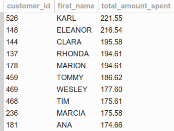
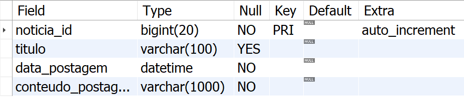
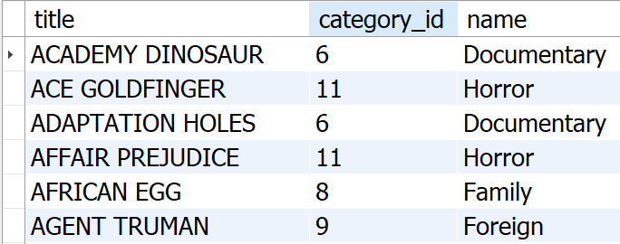
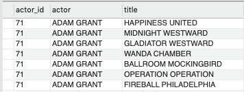
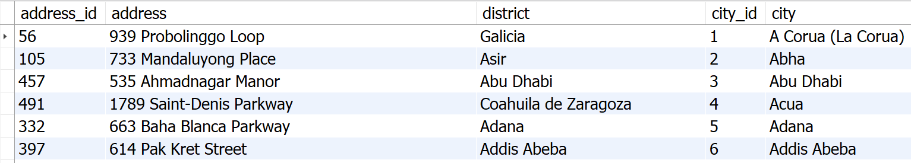
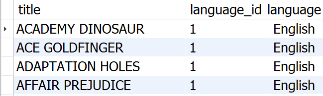

# 22.3 Transforming ideas into a database model - Part 2

> ### :warning: Translation to **English** under construction :construction:

### Habilidades desenvolvidas neste repositório:
- Clonar tabelas existentes;
- Lidar com `VIEWs`;
- Alterar tabelas existentes;
- Deletar uma tabela;
- Usar um `INDEX`.

<br>


### Clonar tabelas existentes

```sql

-- Sintaxe:
CREATE TABLE nome_para_nova_tabela LIKE tabela_a_ser_clonada;

-- Exemplo:
CREATE TABLE actor_clone LIKE sakila.actor;

```

- Esse comando não copia os dados, apenas a estrutura;
- Caso não especifique qual banco de dados utilizar, a nova tabela será inserida no banco que estiver ativo no momento da execução. Sendo assim, sempre especifique o banco de dados antes.

```sql

USE nome_do_banco_de_dados;

CREATE TABLE nome_para_nova_tabela LIKE tabela_a_ser_clonada;

```

<br>

### Anatomia de uma `VIEW`

```sql

-- Defina em qual banco a view será criada
USE nome_do_banco_de_dados;

-- Comando para criar a view
CREATE VIEW nome_da_view AS query;

```

#### Exemplo de uso

Suponha que a gerência quer ter uma maneira simples para sempre saber quem são os top 10 clientes que mais compram com a empresa. Pode-se criar uma view para resolver isso!

```sql

CREATE VIEW top_10_customers AS
  SELECT c.customer_id, c.first_name, SUM(p.amount) AS total_amount_spent
  FROM sakila.payment p
    INNER JOIN 
      sakila.customer c ON p.customer_id = c.customer_id
  GROUP BY customer_id
  ORDER BY total_amount_spent DESC
  LIMIT 10;

```


Agora, caso alguém precise ter acesso a essa informação, você pode consultar a tabela temporária (`VIEW`) diretamente, sem a necessidade de montar uma nova query:

```sql

SELECT * FROM top_10_customers;

```



<br>

Para excluir uma `VIEW`, use o seguinte comando: 

```sql

DROP VIEW nome_da_view;

```

<br>

### Tudo que você deve saber sobre o `ALTER TABLE`
Algo extremamente comum durante o ciclo de desenvolvimento de software é a necessidade constante de fazer melhorias na estrutura do banco de dados. As tabelas são uma dessas estruturas que podem sofrer alterações.

Ao executar o bloco de código abaixo, a tabela `noticia` será criada. Essa tabela será utilizada como exemplo para testar modificações em sua estrutura.

```sql

USE sakila;
CREATE TABLE noticia(
    noticia_id INT PRIMARY KEY,
    titulo VARCHAR(100),
    historia VARCHAR(300)
) engine = InnoDB;

```

Abaixo, algumas das alterações que podem ser feitas em uma tabela.

```sql

-- Adicionar uma nova coluna
ALTER TABLE noticia ADD COLUMN data_postagem date NOT NULL;

-- Modificar o tipo e propriedades de uma coluna
ALTER TABLE noticia MODIFY noticia_id BIGINT;

-- Adicionar incremento automático a uma coluna
-- (especifique o tipo da coluna + auto_increment)
ALTER TABLE noticia MODIFY noticia_id BIGINT auto_increment;

-- Alterar o tipo e nome de uma coluna
ALTER TABLE noticia CHANGE historia conteudo_postagem VARCHAR(1000) NOT NULL;

-- Dropar/Excluir uma coluna
ALTER TABLE noticia DROP COLUMN data_postagem;

-- Adicionar uma nova coluna após outra
ALTER TABLE noticia ADD COLUMN data_postagem DATETIME NOT NULL AFTER titulo;

```

Com os comandos acima, foram cobertas as operações mais comuns que você deve saber para alterar uma tabela. Para confirmar se a estrutura da sua tabela foi alterada corretamente, você pode usar o comando `SHOW COLUMNS FROM nome_da_tabela`. 
Veja o exemplo abaixo:

```sql

SHOW COLUMNS FROM sakila.noticia;


```



<br>

### `INDEX`

#### Pontos positivos:
- Acelera as queries (SELECT);
- Permite tornar uma coluna com valores únicos (UNIQUE);
- Permite buscar em grandes pedaços de textos (FULLTEXT INDEX);
- Aceleram as operações de update que usam WHERE.

#### Pontos negativos:
- Ocupam espaço em disco;
- Tornam lentas as operações de INSERT, UPDATE E DELETE, porque cada índice precisa ser atualizado junto com os dados.

#### Quando NÃO utilizar índices:
- Em tabelas pequenas, pois a diferença de performance será mínima, se houver;
- Em colunas que retornarão uma grande quantidade de dados quando filtradas. Por exemplo, você não adicionaria os artigos "o" e "a" ao índice de um livro;
- Em tabelas que frequentemente têm atualizações em grande escala, uma vez que a performance dessas atualizações será afetada;
- Em colunas que são frequentemente manipuladas, haja vista que a manutenção do índice dessa coluna pode demandar muito tempo quando feita em excesso;
- Em colunas que possuem muitos valores nulos.


#### 1. Criando um index após ter criado uma tabela:


```sql

--VALORES NUMÉRICOS
CREATE INDEX nome_index ON tabela(coluna);


--VALORES GRANDES
CREATE FULLTEXT INDEX nome_index ON tabela(coluna);

```
<br>

#### 2. Criando um index junto com a criação da tabela:

```sql

CREATE DATABASE IF NOT EXISTS pizzaria;

USE pizarria;

CREATE TABLE pizzas(
  pizza_id INT PRIMARY KEY,
  sabor VARCHAR(100),
  preco DECIMAL(5,2),
  INDEX sabor_index(sabor)
) ENGINE=InnoDB;

```

<br>

#### 3. Criando um index alterando uma tabela:

```sql

ALTER TABLE nome_tabela
ADD INDEX nome_index(nome_coluna);

```

<br>

#### Resumo de opções:

```sql

-- Criando um índice em uma coluna
CREATE [INDEX | FULLTEXT INDEX | UNIQUE INDEX] nome_indice
ON tabela (coluna);

-- Criando um índice composto, em duas ou mais colunas
CREATE [INDEX | FULLTEXT INDEX | UNIQUE INDEX] nome_indice
ON tabela (coluna1, coluna2);

-- Excluindo índices
DROP INDEX nome_do_indice ON tabela;

```

<br>


# EXERCÍCIOS

### [1] Crie uma view chamada `film_with_categories` utilizando as tabelas `category`, `film_category` e `film` do banco de dados `sakila`. 
Essa view deve exibir o **título** do filme, o **id da categoria** e o **nome da categoria**, conforme a imagem abaixo. Os resultados devem ser **ordenados pelo título do filme**.



<br>

### [2] Crie uma view chamada `film_info` utilizando as tabelas `actor`, `film_actor` e `film` do banco de dados `sakila`. 
Sua view deve exibir o `actor_id`, o **nome completo do ator** em uma coluna com o `ALIAS` **actor** e o **título dos filmes**. Os resultados devem ser **ordenados pelos nomes de atores**. 
Use a imagem a seguir como referência.



<br>

### [3] Crie uma view chamada `address_info` que faça uso das tabelas `address` e `city` do banco de dados `sakila`. 
Sua view deve exibir o `address_id`, o `address`, o `district`, o `city_id` e a `city`. Os resultados devem ser **ordenados pelo nome das cidades**. 
Use a imagem abaixo como referência.



<br>

### [4] Crie uma view chamada `movies_languages`, usando as tabelas `film` e `language` do banco de dados `sakila`. 
Sua view deve exibir o **título do filme**, o **id do idioma** e o **idioma do filme**, como na imagem a seguir.



<br>

### [5] Verifique o impacto de um `FULLTEXT INDEX` na tabela `category` (banco de dados `sakila`), adicionando-o na coluna `name`. 
Após ter adicionado o **índice**, mensure o custo da query utilizando o execution plan, como já foi feito em lições anteriores. Após ter criado e mensurado o custo da query, exclua o índice e mensure novamente esse custo.

```sql

-- Após ter criado o índice, mensure o custo com a seguinte query:
SELECT *
FROM sakila.category
WHERE MATCH(name) AGAINST('action');

-- Após ter excluído o índice, mensure o custo com a seguinte query:
SELECT *
FROM sakila.category
WHERE name LIKE '%action%';

```

<br>

### [6] Verifique o impacto de um `INDEX` na tabela `address` (banco de dados `sakila`) adicionando-o na coluna `postal_code`. 
Após ter adicionado o **índice**, mensure o custo da query utilizando o execution plan, como já foi feito em lições anteriores. Após ter criado e mensurado o custo da query, exclua o índice e mensure novamente esse custo.

```sql

-- Mensure o custo com a seguinte query:
SELECT *
FROM sakila.address
WHERE postal_code = '36693';

```

<br>

## Restaure o banco de dados HR abaixo antes de continuar.
O banco de dados pode ser restaurado através deste [arquivo SQL](https://s3.us-east-2.amazonaws.com/assets.app.betrybe.com/back-end/sql/hr-cebf8bc2a5bb252bc470ae28943604c6.sql).

### [7] Escreva uma query para alterar na tabela `locations` o nome da coluna **street_address** para **address**, mantendo o mesmo tipo e tamanho de dados.

<br>

### [8] Escreva uma query para alterar o nome da coluna `region_name` para `region`, mantendo o mesmo tipo e tamanho de dados.

<br>

### [9] Escreva uma query para alterar o nome da coluna `country_name` para `country`, mantendo o mesmo tipo e tamanho de dados.
