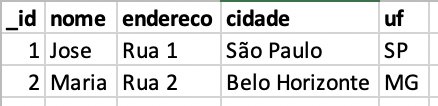

# 23.1 NoSQL and MongoDB

> ### :warning: Translation to **English** under construction :construction:

### Habilidades desenvolvidas:
- Instalar e conectar-se ao MongoDB ;
- Listar bancos de dados e coleções;
- Inserir documentos no banco de dados usando o `insert()`;
- Pesquisar documentos no banco de dados usando o `find()`;
- Contar a quantidade de documentos retornados usando o `count()`;
- Filtrar o resultado das suas pesquisas;
- Limitar e pular os documentos retornados;
- Fazer uma paginação simples combinando os métodos `limit()` e o `skip()`.
- Entender o que é uma projeção e como utilizá-la;

<br>

- [Exercícios](#exercícios)

<br>

### Funcionamento do MongoDB

Assim como nos sistemas gerenciadores de bancos de dados relacionais, dentro de uma mesma instância do MongoDB você pode ter um ou vários bancos de dados. Uma grande diferença, é que não temos a formalidade de criar um banco de dados antes de fazer uma operação nele.

Por exemplo, quando vamos fazer um insert , o MongoDB cuida disso para você: criando o banco e a coleção (caso não existam previamente) juntos com o documento inserido. Tudo isso em uma mesma operação.

Uma vez conectado à uma instância do MongoDB através do MongoDB Shell , você só precisa especificar o contexto em que essa escrita acontecerá. Nesse caso, o contexto é o nome do banco de dados que você quer criar:

```sql
use nomeDoBanco
db.nomeDaColecao.insertOne( { x: 1 })
```

Feito! A função `insertOne()` cria tanto o banco de dados **nomeDoBanco** , como a coleção **nomeDaColecao**, caso eles não existam. Se existirem, apenas mapeia o documento a ser inserido dentro deles e, por fim, executa a operação.

Uma dica para nomear bancos e coleções é seguir [este guia](https://docs.mongodb.com/manual/reference/limits/#restrictions-on-db-names).

<br>

### Coleções
Como citado anteriormente, os **documentos** no **MongoDB** são armazenados dentro das **coleções**. 

Lembrando que uma **coleção** é equivalente à uma **tabela** dos bancos de dados relacionais.

<br>

### Criando uma coleção

Como você viu, se uma coleção não existe, o MongoDB cria essa coleção no momento do primeiro `insert`.

```sql
db.nomeDaColecao1.insertOne({ x: 1 })
db.nomeDaColecao2.createIndex({ y: 1 })
```

Veja que tanto as operações `insertOne()` e `createIndex()` criam uma nova coleção (caso ela não exista).

<br>

### Criação explícita

Você também pode utilizar o método `db.createCollection()` para criar uma coleção e especificar uma série de parâmetros, como o tamanho máximo do documento ou as **regras de validação para os documentos**.

Se você não quiser especificar algum desses parâmetros, o uso do método para criação não é necessário. O exemplo abaixo cria uma coleção, especificando sua [collation](https://docs.mongodb.com/manual/reference/collation/#collation-document-fields).

```sql
db.createCollection( "nomeDaColecao", { collation: { locale: "pt" } } );
```

Você pode fazer modificações nos parâmetros de uma coleção através do [collMod](https://docs.mongodb.com/manual/reference/command/collMod/#dbcmd.collMod).
Você pode ver mais sobre o método `db.createCollection()` na própria [documentação](https://docs.mongodb.com/manual/reference/method/db.createCollection/#db.createCollection).

<br>

### Documentos

Como dito, os **documentos** são equivalentes aos registros ou linhas de uma tabela nos bancos de dados relacionais. Além disso, cada atributo (campo) é equivalente a uma coluna de uma linha da tabela. Sua diferença é que documentos podem conter estruturas mais ricas, diferentes entre documentos, e armazenar muito mais informações do que você consegue em uma "linha simples" de uma tabela relacional. 

Abaixo, temos uma representação de um registro numa tabela relacional, e também o seu correspondente em um **documento**:



```sql
{
    "_id": 1,
    "nome": "Jose",
    "endereco": {
        "logradouro": "Rua 1",
        "regiao": "Zona Norte",
        "cidade": "São Paulo",
        "uf": "SP"
    }
},
{
    "_id": 2,
    "nome": "Maria",
    "endereco": {
        "logradouro": "Rua 2",
        "cidade": "Belo Horizonte",
        "uf": "MG"
    }
}
```

Como visto acima, um `insert` recebe como parâmetro um `JSON`. Esse parâmetro define os dados e a estrutura do documento. É importante ressaltar que, por ser **schemaless**, ou seja, sem esquema por padrão, a estrutura não faz parte da coleção, e sim do **documento**. Com isso, você pode ter várias "estruturas" por coleção. No exemplo acima, podemos observar essa diferença entre os documentos. No primeiro, temos o atributo regiao , que não existe no segundo documento.

Quando você fizer uma alteração, faça-a em nível de documento. Pois caso você a faça em nível de coleção, muitos documentos com estruturas diferentes poderão ser impactados com a criação, alteração ou remoção de um atributo que não faz parte da estrutura de todos (veremos isso mais à frente).

<br>

### Validação de documentos
Você pode aplicar uma validação para que cada operação de escrita em sua coleção respeite uma estrutura. Utilize o [Schema Validation](https://docs.mongodb.com/manual/core/schema-validation/) para isso.

<br>

### BSON Types
Por mais que o `insert` ocorra recebendo um documento `JSON`, internamente, o MongoDB armazena os dados em um formato chamado `BSON` (**Binary JSON**). Esse formato é uma extensão do JSON e permite que você tenha mais tipos de dados armazenados no MongoDB, não somente os tipos permitidos pelo JSON.

<br>

### Insert

Você vai fazer algumas inserções no MongoDB utilizando duas funções específicas e também com schemas diferentes e mais "ricos"!

Os métodos `insertOne()` e `insertMany()` têm suas particularidades e limitações. Enquanto um faz a inserção de um único documento por vez, o outro pode inserir milhares de documentos em uma única operação. Portanto, saber quando e onde aplicar fará toda a diferença quando você estiver codificando.

Os documentos mais "ricos" são aqueles de estruturas bem complexas que você pode armazenar em suas coleções, deixando os seus dados aninhados e com muitas informações, e sem a necessidade de `joins` para acessá-los em outras coleções.

Você já viu como os dados são armazenados no MongoDB , viu o conceito de bancos de dados, coleções e documentos. Agora você vai aprender como, efetivamente, criar todos esses elementos.

<br>

### insertOne()

```sql
> show dbs --Mostra todos os bancos de dados registrados
admin     41 kB
config  12.3 kB
local   73.7 kB

> use veiculos --Muda para o banco de dados especificado (cria um banco se aquele nome não existir)
switched to db veiculos

> db --verifica em qual banco de dados estamos trabalhando no momento
veiculos

> db.carros.insertOne({nome: "Fusca", preco: 2000}) --insere UMA coleção (carros) e UM documento (Fusca, R$ 2000)
{
  acknowledged: true, --retorno do comando insertOne()
  insertedId: ObjectId("60be79262a10e013d1baa9e5") --quando não é especificado, retorna um id automagicamente
}

> db.carros.insertOne({_id: 1, nome: "Camaro", preco: 250000}) --especificando um id
{ acknowledged: true, insertedId: 1 }

> db.carros.find(); --comando que retorna os documentos registrados na coleção "carros"
[
  {
    _id: ObjectId("60be79262a10e013d1baa9e5"),
    nome: 'Fusca',
    preco: 2000
  },
  { _id: 1, nome: 'Camaro', preco: 250000 }
]

```

<br>

### insertMany()

```js
db.carros.insertMany([
  {
    "_id": 1,
    "nome": "Gol",
    "preco": 15000,
    "portas": 4,
    "status": "usado"
  },
  {
    "_id": 2,
    "nome": "Onix",
    "preco": 25000,
    "portas": 4,
    "status": "semi-novo"
  },
  {
    "_id": 1, //id duplicado
    "nome": "Gol",
    "preco": 15000,
    "portas": 4,
    "status": "usado"
  },
  {
    "_id": 3,
    "nome": "Marea",
    "preco": 1000,
    "portas": 4,
    "status": "usado"
  },
  {
    "_id": 4,
    "nome": "Kombi",
    "preco": 10000,
    "portas": 3,
    "status": "semi-novo"
  },
  {
    "_id": 5,
    "nome": "Compass",
    "preco": 100000,
    "portas": 4,
    "status": "novo"
  }
], {ordered: false}); //este segundo parametro desabilita a forma de ordenação padrão (continua realizando as inserções (corretas) caso aconteça algum erro no meio do processo)

```

<br>

### Parâmetros do find()
O método `find()` serve para selecionar os documentos de uma coleção e retorna um cursor com esses documentos.

Esse método recebe dois parâmetros:
`db.collection.find(query, projection)`
- `query` (opcional):
  - Tipo: documento;
  - Descrição: especifica os filtros da seleção usando os query operators . Para retornar todos os documentos da coleção, é só omitir esse parâmetro ou passar um documento vazio ({}).

- `projection` (opcional):
  - Tipo: documento;
  - Descrição: especifica quais atributos serão retornados nos documentos selecionados pelo parâmetro query. Para retornar todos os atributos desses documentos, é só omitir esse parâmetro.

Esse método retorna um **cursor** para os documentos que correspondem aos critérios de consulta.

<br>

### Projeção (projection)

Como dito, o parâmetro projection determina quais atributos serão retornados dos documentos que atendam aos critérios de filtro. O formato recebido por ele é algo como:

```js
{ "atributo1": <valor>, "atributo2": <valor> ... }
```

O `<valor>` pode ser uma das seguintes opções:
- **1** ou **true** para incluir um campo nos documentos retornados;
- **0** ou **false** para excluir um campo;
- Uma expressão usando [Projection Operators](https://docs.mongodb.com/manual/reference/operator/projection/).

Você pode escolher exibir no resultado da consulta apenas certos atributos.

A projeção é sempre o segundo parâmetro do método `find()`.

Veja só este exemplo:

```js
db.movies.insertOne(
  {
    "title" : "Forrest Gump",
    "category" : [ "drama", "romance" ],
    "imdb_rating" : 8.8,
    "filming_locations" : [
      { "city" : "Savannah", "state" : "GA", "country" : "USA" },
      { "city" : "Monument Valley", "state" : "UT", "country" : "USA" },
      { "city" : "Los Anegeles", "state" : "CA", "country" : "USA" }
    ],
    "box_office" : {
      "gross" : 557, "opening_weekend" : 24, "budget" : 55
    }
  }
)
```

A operação acima insere um documento na coleção movies com vários atributos. 

Com a operação abaixo, selecionamos esse documento na coleção `movies`, passando como parâmetro de **projeção** apenas os atributos `title` e `imdb_rating`:

```js
db.movies.findOne(
  { "title" : "Forrest Gump" },
  { "title" : 1, "imdb_rating" : 1 }
)
```

Como resultado, teremos o seguinte:

```js
{
  "_id" : ObjectId("5515942d31117f52a5122353"),
  "title" : "Forrest Gump",
  "imdb_rating" : 8.8
}
```

Note que o atributo `_id` também foi retornado. Isso acontece porque ele é o único atributo que você não precisa especificar para que seja retornado. O movimento aqui é ao contrário, se você não quiser vê-lo no retorno, é só suprimí-lo da seguinte forma:

```js
db.movies.findOne(
  { "title" : "Forrest Gump" },
  { "title" : 1, "imdb_rating" : 1, "_id": 0 }
)
```

Agora sim, nosso resultado será apenas com os atributos devidos:

```js
{
  "title" : "Forrest Gump",
  "imdb_rating" : 8.8
}
```

<br>

### Gerenciamento do cursor
Ao executar o método `find()`, o **MongoDB Shell** itera automaticamente o cursor para exibir os 20 primeiros documentos. Digite `it` para continuar a iteração. Assim, mais 20 documentos serão exibidos até o final do cursor.

Um método bastante interessante que é utilizado num cursor é o `count()`. O método `count()` retorna o número de documentos de uma coleção, e também pode receber um critério de seleção para retornar apenas o número de documentos que atendam a esse critério.

Você pode retornar o número de documentos de uma coleção com a seguinte operação:

```js
db.movies.count()
```

Veremos adiante mais utilizações para o método `count()`.


<br>

### Tipos e comparações
O MongoDB trata alguns tipos de dados como equivalentes para fins de comparação. Por exemplo, tipos numéricos sofrem conversão antes da comparação. No entanto, para a maioria dos tipos de dados, os [operadores de comparação](https://docs.mongodb.com/manual/reference/operator/query-comparison/) realizam comparações apenas em documentos em que o [tipo BSON](https://docs.mongodb.com/manual/reference/bson-type-comparison-order/#bson-types-comparison-order) do atributo destino do documento corresponde ao tipo do operando da query.

Para compreender melhor esse conceito, veja o exemplo abaixo, considerando a seguinte coleção:

```js
{ "_id": "apples", "qty": 5 }
{ "_id": "bananas", "qty": 7 }
{ "_id": "oranges", "qty": { "in stock": 8, "ordered": 12 } }
{ "_id": "avocados", "qty": "fourteen" }
```

A operação abaixo usa o operador de comparação $gt( greater than , maior que, >) para retornar os documentos em que o valor do atributo qty seja maior do que 4 :


```js
db.collection.find( { qty: { $gt: 4 } } )
```

A operação trará como retorno os seguintes documentos:

```js
{ "_id": "apples", "qty": 5 }
{ "_id": "bananas", "qty": 7 }
```

O documento com o `_id` igual a "**avocados**" não foi retornado porque o valor do campo `qty` é do tipo string , enquanto o operador `$gt` é do tipo **integer**.

O documento com o `_id` igual a "**oranges**" também não foi retornado porque qty é do tipo **object**.

Nesses casos, vemos o schemaless funcionando na prática!

<br>

### Utilizando o find()

Para esses exemplos você vai utilizar os documentos de uma coleção chamada [bios](https://docs.mongodb.com/manual/reference/bios-example-collection/). 

Caso você queira executar os exemplos localmente, copie o trecho de código que representa a coleção, e execute no seu cliente do MongoDB para inserí-la em sua instância local.

Os documentos dessa coleção, de maneira geral, têm esse formato:

```js
{
    "_id" : <value>,
    "name" : { "first" : <string>, "last" : <string> },       // documento embedado ou subdocumento
    "birth" : <ISODate>,
    "death" : <ISODate>,
    "contribs" : [ <string>, ... ],                           // Array de Strings
    "awards" : [
        { "award" : <string>, year: <number>, by: <string> }  // Array de subdocumentos
        ...
    ]
}
```

<br>

### Selecionando todos os documentos da coleção
O método `find()`, quando utilizado sem parâmetros, retorna todos os documentos da coleção juntamente com todos os seus campos. Por exemplo, a operação abaixo retorna todos os documentos da coleção [bios](https://docs.mongodb.com/manual/reference/bios-example-collection/):

```js
db.bios.find()
```

Essa operação corresponde à seguinte consulta no SQL:


```js
SELECT * FROM bios;
```

<br>

### Selecionando documentos com critérios de busca

#### Query por igualdade

A operação abaixo retorna os documentos da coleção bios em que o atributo `_id` é igual a `5`:


```js
db.bios.find( { _id: 5 } )
```

Essa operação corresponde à seguinte consulta no SQL :


```js
SELECT * FROM bios WHERE _id = 5;
```

Agora, a operação abaixo retorna todos os documentos da coleção bios em que o campo `last` do subdocumento `name` é igual a `"Hopper"` :


```js
db.bios.find( { "name.last": "Hopper" } )
```

Note que, para acessar campos em subdocumentos, utilizamos [dot notation](https://docs.mongodb.com/manual/core/document/#document-dot-notation-embedded-fields) (por exemplo, `"subdocumento.atributo"` ).

<br>

### Projetando somente os atributos requeridos:

Através do segundo parâmetro do método `find()`, podemos especificar quais atributos serão retornados. O exemplo abaixo retorna todos os documentos da coleção bios , trazendo apenas o atributo `name` de cada documento:


```js
db.bios.find({}, { name: 1 })
```

Lembrando que o atributo `name` é um **subdocumento**, pois armazena um objeto com outros atributos.
Essa operação corresponde à seguinte consulta no **SQL**:

```js
SELECT name FROM bios;
```

>Procure utilizar a projeção para diminuir a quantidade de campos retornados pelo cursor. Isso ajuda muito no que se refere ao tráfego desses dados na rede!

<br>

### Limitando o número de documentos retornados

#### limit()

Você pode limitar o número de documentos retornados por uma consulta utilizando o método `limit()`. Esse método é semelhante à declaração `LIMIT` em um banco de dados que utiliza **SQL**.

Uma utilização comum do `limit()` é para maximizar a performance e evitar que o MongoDB retorne mais resultados do que o necessário para o processamento.

O método `limit()` é utilizado da seguinte forma:

```js
db.collection.find(<query>).limit(<número>)
```


Um exemplo utilizando a coleção [bios](https://docs.mongodb.com/manual/reference/bios-example-collection/)

```js
db.bios.find().limit(5)
```

Essa operação corresponde à seguinte consulta no SQL :

```js
SELECT * FROM bios LIMIT 5;
```


#### pretty()

Com o método `pretty()` você pode deixar os resultados exibidos no MongoDB Shell um pouco mais legíveis. Esse método aplica uma indentação na exibição dos resultados no console, de forma que fica bem melhor de ler.
Exemplo de utilização do método `pretty()`, usando a coleção [bios](https://docs.mongodb.com/manual/reference/bios-example-collection/):


```js
db.bios.find().limit(5).pretty()
```

<br>

### "Pulando" documentos

#### skip(<número>)

Acione o método `skip()` para controlar a partir de que ponto o MongoDB começará a retornar os resultados. Essa abordagem pode ser bastante útil para realizar paginação dos resultados.

O método `skip()` precisa de um **parâmetro numérico** que determinará **quantos documentos** serão **"pulados"** antes de começar a retornar.

O exemplo abaixo na coleção [bios](https://docs.mongodb.com/manual/reference/bios-example-collection/) pulará os dois primeiros documentos e retornará o cursor a partir daí:

```js
db.bios.find().skip(2)
```

Você pode combinar os métodos `limit()` e `skip()` criando, assim, uma paginação:


```js
db.bios.find().limit(10).skip(5)
```

Essa operação corresponde à seguinte consulta no SQL :

```js
SELECT * FROM bios LIMIT 10 OFFSET 5;
```


<br>

# EXERCÍCIOS
db
O **MongoDB** possui diversas ferramentas como, por exemplo: **mongo**, **mongosh**, **Compass** e outras ferramentas de terceiros. Você pode utilizar o que achar melhor para executar as queries.

>Utilizando a coleção [bios](https://docs.mongodb.com/manual/reference/bios-example-collection/), construa queries para retornar os seguintes itens:

**Exercício 1**: Retorne o documento com o `_id` igual a `8`.

<details>
<summary>Mostrar resposta</summary>

<br>

```js
db.bios.find( {_id: 8} );
```

</details>

<hr>
<br>

**Exercício 2**: Retorne o documento com o `_id` igual a `8`, mas só exiba os atributos: `_id` e `name`.

<details>
<summary>Mostrar resposta</summary>

<br>

```js
db.bios.find( {_id: 8}, {name: 1} );
```

</details>

<hr>
<br>

**Exercício 3**: Retorne apenas os atributos `name` e `birth` do documento com o `_id` igual a `8`.

<details>
<summary>Mostrar resposta</summary>

<br>

> 
```js
db.bios.find( {_id: 8}, {_id: 0, name: 1, birth: 1} );
```
> 

</details>

<hr>
<br>

**Exercício 4**: Retorne **todos os documentos** em que o atributo `name.first` seja igual a `John`, utilizando o método `pretty()`.

<details>
<summary>Mostrar resposta</summary>

<br>

> 
```js
db.bios.find( {}, {'name.first': 'John'} ).pretty();
```
> 

</details>

<hr>
<br>

**Exercício 5**: Retorne os **3 primeiros documentos** da coleção [bios](https://docs.mongodb.com/manual/reference/bios-example-collection/) utilizando o método `pretty()`.

<details>
<summary>Mostrar resposta</summary>

<br>

> 
```js
db.bios.find({}).limit(3).pretty();
```
> 

</details>

<hr>
<br>

**Exercício 6**: Retorne **2 documentos** da coleção bios **pulando os 5 primeiros documentos**.

<details>
<summary>Mostrar resposta</summary>

<br>

> 
```js
db.bios.find().limit(2).skip(5);
```
> 

</details>

<hr>
<br>

>Utilizando o [mongoimport](https://docs.mongodb.com/database-tools/mongoimport/#examples), importe o arquivo [books.json](https://s3.us-east-2.amazonaws.com/assets.app.betrybe.com/back-end/mongodb/books-48d15e4d8924badc2308cc4a62eb3ea4.json) para a sua instância local do MongoDB e utilize a coleção `books` para construir as seguintes consultas:

```shell
<<TERMINAL:
mongoimport --db=class --collection=books --file=books.json
```

**Exercício 7**: Retorne a quantidade de documentos da coleção `books`.

<details>
<summary>Mostrar resposta</summary>

<br>

> 
```js
db.books.count();
```
> 

</details>

<hr>
<br>

**Exercício 8**: Conte quantos livros existem com o `status = "PUBLISH"` .

<details>
<summary>Mostrar resposta</summary>

<br>

> 
```js
db.books.count(
  { 'status': 'PUBLISH' }
);
```
> 

</details>

<hr>
<br>

**Exercício 9**: Exiba os atributos `title`, `isbn` e `pageCount` dos **3 primeiros livros**. *NÃO retorne o atributo _id*.

<details>
<summary>Mostrar resposta</summary>

<br>

> 
```js
db.books.find( 
  {},
  {
    _id: 0,
    title: 1,
    isbn: 1,
    pageCount: 1
  }
).limit(3);
```
> 

</details>

<hr>
<br>

**Exercício 10**: **Pule 5 documentos** e exiba os atributos `_id`, `title`, `authors` e `status` dos livros com o `status = "MEAP"`, **limitando-se a 10 documentos**.

<details>
<summary>Mostrar resposta</summary>

<br>

> 
```js
db.books.find(
  {
    status: 'MEAP'
  },
  {
    title: 1,
    authors: 1,
    status: 1
  }
).skip(5).limit(10);
```
> 

</details>
