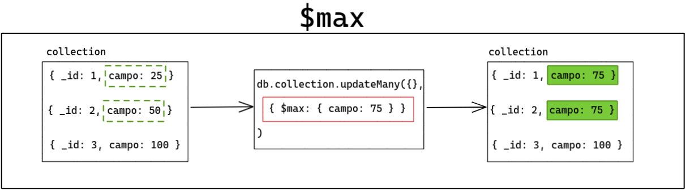
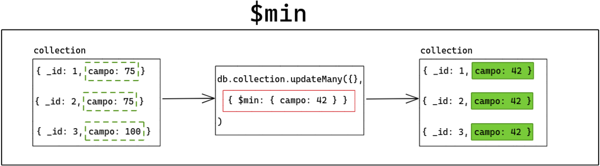

# 24.1 Updates simples

> ### :warning: Translation to **English** under construction :construction:

### Habilidades desenvolvidas:
- Utilizar o método `updateOne()`;
- Utilizar o método `updateMany()`;
- Utilizar os operadores `$set`, `$mul`, `$inc`, `$min`, `$max` e `$currentDate`;
- Renomear campos;
- Remover campos.
- [Exercícios](#exercícios)

<br>

## Alterando um único documento

```js
db.inventory.updateOne(
  { item: "paper" },
  { $set: { "size.uom": "cm", status: "P" } }
);
```

**Note que dois parâmetros foram passados no método:**
- O primeiro deles é o filtro. Nesse caso, um filtro simples de igualdade, mas outros operadores podem ser utilizados aqui;
- O segundo é a operação de update em si. Nesse caso, foi utilizado o operador de atualização $set para alterar o valor do campo size.uom para cm e o valor do campo status para P .

>⚠️ Chamando o método db.colecao.updateOne() com o parâmetro de filtro vazio { }, o resultado é a atualização do primeiro documento presente em colecao. ⚠️

<br>

## Alterando múltiplos documentos

```js
db.inventory.updateMany(
  { "qty": { $lt: 50 } },
  { $set: { "size.uom": "in", status: "P" } }
);
```
A operação acima utiliza o operador $set para alterar o valor do campo size.uom para in e o valor do campo status para P.

Ou seja, se você tiver 10 documentos na coleção inventory em que o valor do campo qty seja menor do que 50 (esse valor foi passado como parâmetro do filtro e utilizou o operador $lt ), todos esses documentos serão alterados em uma única operação.

>⚠️ Chamando o método db.colecao.updateMany() com o parâmetro de filtro vazio { } , o resultado é a atualização de todos os documentos presentes em colecao . ⚠️

<br>

## Operador $set

Como você viu nos exemplos acima, o $set altera o valor de um campo específico.

Se o campo não existir, o operador $set adiciona um novo campo com o valor especificado. Se você especificar campos com [dot notation](https://docs.mongodb.com/manual/core/document/#document-dot-notation-embedded-fields), os documentos embedados necessários serão criados para suprir o caminho do campo.

Você pode especificar múltiplos pares de campos-valores que o operador $set alterará ou criará cada um desses campos.

Veja alguns exemplos considerando a coleção products com o seguinte documento:

```js
use conteudo_trybe;

db.products.insertOne({
  _id: 100,
  sku: "abc123",
  quantity: 250,
  instock: true,
  reorder: false,
  details: { model: "14Q2", make: "xyz" },
  tags: [ "apparel", "clothing" ],
  ratings: [ { by: "ijk", rating: 4 } ]
})
```

### Exemplo 1: Alterando campos no primeiro nível (top-level)

Para o documento que corresponder ao critério de filtro em que o campo _id seja igual a 100 , a operação a seguir altera o valor dos campos quantity , details e tags :

```js
db.products.update(
  { _id: 100 },
  { $set: {
      quantity: 500,
      details: { model: "14Q3", make: "xyz" },
      tags: [ "coats", "outerwear", "clothing" ]
    }
  }
);
```

A operação acima altera o valor de quantity para 500 , details para um novo documento embedado e tags para um novo array .
No exemplo acima, vários campos foram agrupados e, com isso, são alterados em um mesmo comando! Assim, você pode alterar vários campos de uma única vez.

### Exemplo: Alterando campos em documentos embedados

Para alterar campos dentro de subdocumentos, você deve utilizar o mesmo conceito de dot notation visto durante as operações de find().

A operação abaixo altera o valor do campo make dentro do subdocumento details em que o campo _id seja igual a 100 :

```js
db.products.update(
  { _id: 100 },
  { $set: { "details.make": "zzz" } }
);
```

### Exemplo: Alterando valores em arrays

Como visto, arrays são uma estrutura muito importante na modelagem de dados do MongoDB , e em algum momento você precisará fazer updates nessas estruturas.

A query abaixo tem como critério de seleção o campo _id igual a 100 . Ela altera o segundo elemento (índice 1 ) do array tags e o campo rating no primeiro elemento (índice 0 ) do array ratings:

```js
db.products.update(
  { _id: 100 },
  { $set: {
      "tags.1": "rain gear",
      "ratings.0.rating": 2
    }
  }
);
```

Na operação acima, a posição no array está especificada explicitamente. 
Mais à frente, veremos como fazer para que esse valor seja dinâmico, dependendo de um critério de seleção. Veremos também a utilização de outros operadores mais específicos para operações em arrays .

<br>

## Operador $mul

O operador $mul multiplica o valor de um campo por um número especificado, persistindo o resultado dessa operação sem a necessidade do operador $set.

Considere a coleção products com o novo documento descrito abaixo:

```js
db.products.insertOne(
  { "_id": 1, "item": "ABC", "price": NumberDecimal("10.99"), "qty": 25 }
);
```

A query abaixo altera esse documento, utilizando o operador $mul para multiplicar os valores dos campos price e qty :


```js
db.products.update(
  { _id: 1 },
  { $mul: { price: NumberDecimal("1.25"), qty: 2 } }
);
```

O resultado dessa operação é o documento abaixo, em que o novo valor do campo price é o valor original 10.99 multiplicado por 1.25 , e o valor do campo qty , que originalmente era 25 , é multiplicado por 2 :


```js
{ "_id": 1, "item": "ABC", "price": NumberDecimal("13.7375"), "qty": 50 }
```

Você pode utilizar o $mul em um campo que não exista no documento. Nesse caso, o operador criará o campo e atribuirá a ele o valor zero do mesmo tipo numérico do multiplicador .
Considerando um outro documento na coleção products :

```js
db.products.insertOne(
  { _id: 2, item: "Unknown" }
);
```

A query abaixo faz um update no documento, aplicando o operador $mul no campo price , que não existe neste documento:


```js
db.products.update(
  { _id: 2 },
  { $mul: { price: NumberLong("100") } }
);
```

Como resultado, temos o campo price criado no documento com valor zero do mesmo tipo numérico do multiplicador. Nesse caso, o tipo é NumberLong :


```js
{ "_id": 2, "item": "Unknown", "price": NumberLong(0) }
```

Você também pode multiplicar valores com tipos diferentes. Veja o documento abaixo:


```js
db.products.insertOne(
  { _id: 3,  item: "XYZ", price: NumberLong("10") }
);
```

A query abaixo faz um update , multiplicando o valor do campo price , que é do tipo NumberLong("10") , por NumberInt(5) :


```js
db.products.update(
  { _id: 3 },
  { $mul: { price: NumberInt(5) } }
);
```

E como resultado temos o seguinte:


```js
{ "_id": 3, "item": "XYZ", "price": NumberLong(50) }
```

Saiba mais sobre as [Regras de Conversão de Tipos em Multiplicações](https://docs.mongodb.com/manual/reference/operator/update/mul/#multiplication-type-conversion).

<br>

## Operador $inc

Com o operador $inc , você pode incrementar ou decrementar valores em um campo específico, utilizando tanto valores positivos quanto negativos.

Esse operador é bastante útil para fazer alterações em campos numéricos sem a necessidade prévia de uma consulta para retornar o valor atual do campo. Com o $inc, em uma única operação isso é possível!

Considere que você tenha o seguinte documento na coleção increment :

```js
db.increment.insertOne(
  {
    _id: 1,
    sku: "abc123",
    quantity: 10,
    metrics: {
      orders: 2,
      ratings: 3.5
    }
  }
)
```

Na operação de update a seguir, o operador $inc é utilizado para decrementar o valor do campo qty em 2 (incrementa em -2 ) e incrementar o valor do campo metrics.orders em 1 :


```js
db.increment.update(
  { sku: "abc123" },
  { $inc: { quantity: -2, "metrics.orders": 1 } }
);
```

O documento alterado ficará assim:


```js
{
  "_id": 1,
  "sku": "abc123",
  "quantity": 8,
  "metrics": {
    "orders": 3,
    "ratings": 3.5
  }
}
```

Note que, em uma única chamada ao operador $inc , você consegue aumentar e diminuir os valores de campos diferentes.

<br>

## Operadores $min e $max

Aqui temos dois operadores que também são bastante interessantes. Ambos fazem o mesmo tipo de comparação antes de executar a operação, porém em "sentidos" diferentes:

- $min : altera o valor do campo para o valor especificado se esse valor especificado é menor do que o atual valor do campo;
- $max : faz o mesmo, porém altera o valor do campo se o valor especificado é maior do que o atual valor do campo.

Ambos podem comparar valores de diferentes tipos, utilizando sempre a [ordem de comparação BSON](https://docs.mongodb.com/manual/reference/bson-type-comparison-order/#faq-dev-compare-order-for-bson-types).

Considere um cenário em que temos uma collection com três documentos, cada documento possui um atributo id e um atributo campo que é um número inteiro :

```js
db.collection.find();

```

Resultado:

```js
[
  { _id: 1, campo: 25 },
  { _id: 2, campo: 50 },
  { _id: 3, campo: 100 }
]
```

A seguir, vamos aplicar um update utilizando o operador $max . Nosso intuito é atingir todos os documentos com o atributo campo que possuem um valor de no máximo 75. Nesse caso, o operador não só define o escopo máximo, como também o conteúdo que o campo deve passar a ter:

```js
db.collection.updateMany({}, { $max: { campo: 75 } });
// Atualizando todos os valores do atributo "campo"
// para 75 caso sejam menores

db.collection.find();
```

Resultado:


```js
[
  { _id: 1, campo: 75 }, // valor anterior: 25
  { _id: 2, campo: 75 }, // valor anterior: 50
  { _id: 3, campo: 100 }, // não encontrou no escopo
]
```

Portanto, teremos os ids 1 e 2 atingidos, alterando o atributo campo para 75.
Com o operador $min é praticamente a mesma coisa, porém na direção inversa:

```js
db.collection.updateMany({}, { $min: { campo: 42 } });
// Atualizando todos os valores do atributo "campo"
// para 42 caso sejam maiores

db.collection.find();
```
Resultado:


```js
[
  { _id: 1, campo: 42 }, // valor anterior: 75
  { _id: 2, campo: 42 }, // valor anterior: 75
  { _id: 3, campo: 42 }, // valor anterior: 100
]
```

Aqui atingimos todas os ids , justamente pelo fato de termos definido um escopo que é de no mínimo, 42. Dessa forma, todos os documentos com atributos campo que tivessem um valor superior, foram redefinidos.

Poderíamos resumir ${max} da seguinte forma em um diagrama:

>$max : "arrasta" os valores para cima.



Por outro lado, o diagrama de ${min} ficaria estruturado da seguinte forma:

>$min : "arrasta" os valores para baixo.



Vamos ver alguns exemplos para ficar mais claro, utilizando o seguinte documento na coleção scores:

```js
use conteudo_trybe;
db.scores.insertOne(
  { _id: 1, highScore: 800, lowScore: 200 }
);
```


### Exemplo 1: Comparando números
No documento de exemplo, o valor atual do campo lowscore é 200 . A operação abaixo utiliza o $min para comparar 200 com o valor especificado 150 e altera o valor do campo lowscore para 150 porque 150 é menor do que 200 :

```js
db.scores.update({ _id: 1 }, { $min: { lowScore: 150 } });

```

Agora o documento modificado na coleção scores ficou assim:


```js
{ _id: 1, highScore: 800, lowScore: 150 }

```

Se você executar a operação abaixo, ela não terá efeito no documento porque o valor do campo lowscore é menor do que 250 , e o documento não será alterado:

```js
db.scores.update({ _id: 1 }, { $min: { lowScore: 250 } })

```

Atualmente, o campo highscore tem o valor 800 . A operação abaixo usa o $max para comparar 800 e o valor especificado 950 , e então altera o valor do campo highscore para 950 porque 950 é maior que 800 :


```js
db.scores.update({ _id: 1 }, { $max: { highScore: 950 } });

```

E o documento agora fica assim:


```js
{ _id: 1, highScore: 950, lowScore: 150 }

```

Assim como no exemplo utilizando o operador $min , a operação abaixo também não afetará em nada o documento porque o valor de highscore é maior do que 870 :


```js
db.scores.update({ _id: 1 }, { $max: { highScore: 870 } });

```

### Exemplo 2: Comparando datas

Você pode utilizar os operadores $min e $max para comparar valores do tipo Date.

Considere o seguinte documento da coleção tags :


```js
use conteudo_trybe;
db.tags.insertOne(
  {
    _id: 1,
    desc: "crafts",
    dateEntered: ISODate("2019-10-01T05:00:00Z"),
    dateExpired: ISODate("2019-10-01T16:38:16Z")
  }
);
```

A operação abaixo utiliza o operador $min para comparar o valor do campo dateEntered e altera seu valor porque 25/09/2019 é uma data menor (anterior) do que o valor atual, ao mesmo tempo em que o operador $max também é usado para comparar o valor do campo dateExpired e altera esse valor porque 02/10/2019 é uma data maior (posterior) do que o valor atual:

```js
db.tags.update(
  { _id: 1 },
  {
    $min: { dateEntered: new Date("2019-09-25") },
    $max: { dateExpired: new Date("2019-10-02") }
  }
);
```

<br>

## Operador $currentDate

O operador $currentDate atribui ao valor de um campo a data corrente , utilizando um tipo Date ou timestamp . Se você não especificar o tipo, por padrão, o MongoDB atribuirá o valor do tipo Date . O operador $currentDate tem a seguinte forma:

```js
{ $currentDate: { <campo>: <typeSpecification>, ... } }
```

typeSpecification pode ser:
- um valor booleano true para atribuir o valor da data corrente ao campo utilizando o tipo Date ; ou
- um documento que especifica o tipo do campo. Esse documento pode ser { $type: "timestamp" } ou { $type: "date" } . Esse operador é case-sensitive e aceita somente letras minúsculas: timestamp ou date .

Veja o funcionamento do operador $currentDate , considerando o seguinte documento da coleção customers :


```js
use conteudo_trybe;
db.customers.insertOne(
  { _id: 1, status: "a", lastModified: ISODate("2013-10-02T01:11:18.965Z") }
);
```

Com a operação abaixo, é possível alterar o valor do campo lastModified para a data corrente e criar o campo cancellation.date com o timestamp corrente, utilizando o operador $currentDate , e ainda alterar o campo status para D e criar o campo cancellation.reason com o valor "user request" , utilizando o operador $set :

```js
db.customers.updateOne(
  { _id: 1 },
  { $currentDate: {
      lastModified: true,
      "cancellation.date": { $type: "timestamp" }
    }, $set: {
      "cancellation.reason": "user request",
      status: "D"
    }
  }
);
```

E então, como resultado, o documento se parecerá com algo assim:


```js
{
  "_id": 1,
  "status": "D",
  "lastModified": ISODate("2020-01-22T21:21:41.052Z"),
  "cancellation": {
    "date": Timestamp(1579728101, 1),
    "reason": "user request"
  }
}
```

<br>

## Renomeando campos com o operador $rename

Você pode querer renomear um determinado atributo de um ou mais documentos. Para isso, utilize o operador $rename.

Esse operador recebe um documento contendo o nome atual do campo e o novo nome. Pode ser utilizado com os métodos updateOne() ou updateMany() , e também pode receber um critério de seleção de documentos.

Considerando o seguinte documento da coleção fruits:

```js
use conteudo_trybe;
db.fruits.insertOne(
  { _id: 100, name: "Banana", quantity: 100, inStock: true }
);
```

A operação a seguir altera o nome do campo name para productName no documento em que o valor do campo name seja igual a Banana :


```js
db.fruits.updateOne(
  { name: "Banana" },
  { $rename: {
      "name": "productName"
    }
  }
);
```

Agora o documento tem a seguinte estrutura:


```js
{ _id: 100, quantity: 100, inStock: true, productName: 'Banana' }
```

<br>

## Removendo campos com o operador $unset

Para remover um ou mais campos de um documento, utilize o operador $unset .
Considerando o documento abaixo na coleção fruits :

```js
{
  _id: 100,
  productName: "Banana",
  quantity: 100,
  inStock: true
}
```

A operação abaixo remove o campo quantity do documento em que o valor do campo productName seja igual a Banana :


```js
db.fruits.updateMany(
  { productName: "Banana" },
  { $unset: { quantity: "" } }
);
```

E, como resultado, o documento ficará assim:


```js
{
  _id: 100,
  productName: "Banana",
  inStock: true
}
```

<br>

# EXERCÍCIOS

Para os exercícios, você utilizará um dataset pequeno com alguns filmes.
Conecte-se à sua instância do MongoDB local e insira os seguintes documentos na coleção movies do banco de dados class:

```js
{
  "title": "Batman",
  "category": [ "action", "adventure" ],
  "imdbRating": 7.6,
  "budget": 35
},
{
  "title": "Godzilla",
  "category": [ "action", "adventure", "sci-fi" ],
  "imdbRating": 6.6
},
{
  "title": "Home Alone",
  "category": [ "family", "comedy" ],
  "imdbRating": 7.4
}

```

**Exercício 1**: Altere o imdbRating para 7.7 no filme Batman .

<details>
<summary>Mostrar resposta</summary>

<br>

```js
```

</details>

<hr>
<br>

**Exercício 2**: Altere budget para 1 no filme Godzilla .


<details>
<summary>Mostrar resposta</summary>

<br>

```js
```

</details>

<hr>
<br>

**Exercício 3**: Altere budget para 15 e imdbRating para 5.5 no filme Home Alone.

<details>
<summary>Mostrar resposta</summary>

<br>

> 
```js
```
> 

</details>

<hr>
<br>

**Exercício 4**: Aumente em 2 o imdbRating do filme Batman ..

<details>
<summary>Mostrar resposta</summary>

<br>

> 
```js
```
> 

</details>

<hr>
<br>

**Exercício 5**: Aumente em 5 o budget do filme Home Alone.

<details>
<summary>Mostrar resposta</summary>

<br>

> 
```js
```
> 

</details>

<hr>
<br>

**Exercício 6**: Multiplique por 4 o imdbRating do filme Batman.

<details>
<summary>Mostrar resposta</summary>

<br>

> 
```js
```
> 

</details>

<hr>
<br>

**Exercício 7**: Renomeie o campo budget para estimatedBudget do filme Batman .

<details>
<summary>Mostrar resposta</summary>

<br>

> 
```js
```
> 

</details>

<hr>
<br>

**Exercício 8**: Utilize o operador $min para alterar o budget para 5 do filme Home Alone.

<details>
<summary>Mostrar resposta</summary>

<br>

> 
```js
db.books.count(

```
> 

</details>

<hr>
<br>

**Exercício 9**: Utilize o operador $max para alterar o imdbRating para 8.6 do filme Godzilla . Além disso, altere a categoria "adventure" para "thriller" do filme Godzilla.

<details>
<summary>Mostrar resposta</summary>

<br>

> 
```js

```
> 

</details>

<hr>
<br>

**Exercício 10**: *Utilizando o operador $currentDate , crie um campo chamado lastUpdated com o tipo timestamp no filme Home Alone.

<details>
<summary>Mostrar resposta</summary>

<br>

> 
```js

```
> 

</details>


<hr>
<br>

**Exercício 11**: Utilizando uma única operação, crie um campo chamado sequels e atribua a ele o valor 0 em todos os documentos.

<details>
<summary>Mostrar resposta</summary>

<br>

> 
```js

```
> 

</details>


<hr>
<br>

**Exercício 12**: Utilizando uma única operação, remova os campos budget e estimatedBudget em todos os documentos.

<details>
<summary>Mostrar resposta</summary>

<br>

> 
```js

```
> 

</details>


<hr>
<br>

**Exercício 13**: Para os filmes Batman ou Home Alone , atribua a imdbRating o valor 17 , caso o valor de imdbRating seja menor que 17.

<details>
<summary>Mostrar resposta</summary>

<br>

> 
```js

```
> 

</details>


<hr>
<br>

**Exercício 14**: Remova o campo class dos documentos que possuem esse campo com o valor unknown.

<details>
<summary>Mostrar resposta</summary>

<br>

> 
```js

```
> 

</details>


<hr>
<br>

**Exercício 15**: Produza uma query que renomeie os campos de name para hero_name , e de true_name para full_name ; adicione o campo power com valor 100, em todos os documentos.

<details>
<summary>Mostrar resposta</summary>

<br>

> 
```js

```
> 

</details>


<hr>
<br>

**Exercício 16**: Produza uma query onde os mutantes class omega ou gama passam a ter seu poder de 500 somente se seu poder for menor que 500.

<details>
<summary>Mostrar resposta</summary>

<br>

> 
```js

```
> 

</details>


<hr>
<br>

**Exercício 17**: Produza uma query onde os mutantes class gama passam a ter seu poder de 300 somente se seu poder for maior que 300.

<details>
<summary>Mostrar resposta</summary>

<br>

> 
```js

```
> 

</details>


<hr>
<br>

**Exercício 18**: Decremente em 100 o poder dos mutantes que não possuem a propriedade class.

<details>
<summary>Mostrar resposta</summary>

<br>

> 
```js

```
> 

</details>


<hr>
<br>

**Exercício 19**: Em apenas uma query adicione o campo areas com o seguinte array como valor: ["Students Room"] a todos os mutantes que são Senior Staff que tenham poder acima de 100 e para todos os Junior Staff com poder acima de 200.

<details>
<summary>Mostrar resposta</summary>

<br>

> 
```js

```
> 

</details>


<hr>
<br>

**Exercício 20**: Em apenas uma query, adicione o campo areas com ["Outside"] a todos os Junior Staff que não tenham o campo areas definido.

<details>
<summary>Mostrar resposta</summary>

<br>

> 
```js

```
> 

</details>
