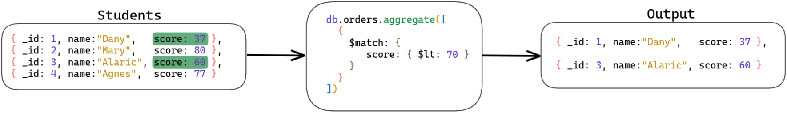
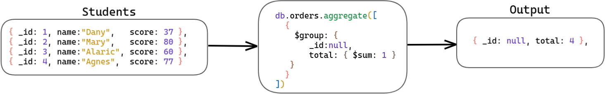

# 25.1 Aggregation Framework - Part 1

> ### :warning: Translation to **English** under construction :construction:

### Habilidades desenvolvidas:
- Filtrar documentos com o estágio `$match`;
- Limitar os resultados com `$limit`;
- Fazer agrupamentos com o `$group`;
- Controlar a exibição de campos com o `$project`.
- Trabalhar com arrays com o `$unwind`;
- Juntar dados de uma ou mais coleções com o `$lookup`;
- [Exercícios](#exercícios)

<br>

## Aggregation Pipeline

O Aggregation Framework foi modelado sob o conceito de processamento de dados por meio de pipelines , ou seja, um "funil" . Um pipeline contém múltiplos estágios. Os documentos entram nesse "funil" e vão se transformando à medida que vão passando por esses estágios até chegarem ao estágio final, com um resultado "agregado".


```js
db.orders.aggregate([
  { $match: { status: "A" } },
  { $group: { _id: "$cust_id", total: { $sum: "$amount" } } }
]);

```

Essa operação possui dois estágios:

Primeiro Estágio : O estágio $match filtra os documentos pelo campo status , e passam para o próximo estágio somente os documentos que têm status igual a "A" .

Segundo Estágio : O estágio $group agrupa os documentos pelo campo cust_id para calcular a soma dos valores do campo amount para cada cust_id único.

<br>

## Operador $match

filtra os documentos da mesma maneira que os filtros no método find({ $match }).



É recomendado sempre priorizar o $match o mais "cedo" possível no pipeline . Isso melhora muito a performance, uma vez que o $match limita o número de documentos passados para o próximo estágio. E se o $match for utilizado bem no começo do pipeline , a query tem a vantagem da utilização de índices.


```js
db.articles.insertMany([
{ _id: ObjectId("512bc95fe835e68f199c8686"), author: "dave", score: 80, views: 100 },
{ _id: ObjectId("512bc962e835e68f199c8687"), author: "dave", score: 85, views: 521 },
{ _id: ObjectId("55f5a192d4bede9ac365b257"), author: "ahn", score: 60, views: 1000 },
{ _id: ObjectId("55f5a192d4bede9ac365b258"), author: "li", score: 55, views: 5000 },
{ _id: ObjectId("55f5a1d3d4bede9ac365b259"), author: "annT", score: 60, views: 50 },
{ _id: ObjectId("55f5a1d3d4bede9ac365b25a"), author: "li", score: 94, views: 999 },
{ _id: ObjectId("55f5a1d3d4bede9ac365b25b"), author: "ty", score: 95, views: 1000 }
])
```

<br>

### Exemplo 1: Igualdade simples

Vamos fazer uma operação utilizando o operador $match com igualdade simples:

```js
db.articles.aggregate(
  [{ $match : { author : "dave" } }]
);
```

A operação citada seleciona todos os documentos em que o campo author seja igual a dave . Note que a sintaxe do filtro é exatamente igual à utilizada como filtro no método find() . A agregação retornará os seguintes documentos:

```js
{ _id: ObjectId("512bc95fe835e68f199c8686"), author: "dave", score: 80, views: 100 }
{ _id: ObjectId("512bc962e835e68f199c8687"), author: "dave", score: 85, views: 521 }
```

<br>

### Exemplo 2: Igualdade complexa
É possível, dentro do match , utilizar operadores como or , and , in etc.

```js
db.articles.aggregate(
  [
    {
      $match: {
        $or: [
          { score: { $gt: 70, $lt: 90 } },
          { views: { $gte: 1000 } }
        ]
      }
    }
  ]
);
```

Nessa operação de agregação, o primeiro e único estágio seleciona todos os documentos da coleção articles em que o score seja maior que 70 e menor que 90, ou o campo views seja maior ou igual a 1000 :


```js
{ "_id" : ObjectId("512bc95fe835e68f199c8686"), "author" : "dave", "score" : 80, "views" : 100 }
{ "_id" : ObjectId("512bc962e835e68f199c8687"), "author" : "dave", "score" : 85, "views" : 521 }
{ "_id" : ObjectId("55f5a192d4bede9ac365b257"), "author" : "ahn", "score" : 60, "views" : 1000 }
{ "_id" : ObjectId("55f5a192d4bede9ac365b258"), "author" : "li", "score" : 55, "views" : 5000 }
{ "_id" : ObjectId("55f5a1d3d4bede9ac365b25b"), "author" : "ty", "score" : 95, "views" : 1000 }
```

<br>


## Operador $limit

O operador $limit limita o número de documentos que será passado para o próximo estágio do pipeline. Ele sempre recebe um valor do tipo inteiro e positivo.

Limitar o número de documentos numa operação de agregação na coleção articles é bem simples:

```js
db.articles.aggregate(
  [
    { $limit : 5 }
  ]
);
```

<br>

## Operador $project

O operador $project tem como uma de suas funções passar adiante no pipeline apenas alguns campos dos documentos vindos do estágio anterior, fazendo isso por meio de uma "projeção", como no método find({}, { $project }) . Mas aqui temos uma diferença: esses campos podem ser novos, sendo resultado de um cálculo ou de uma concatenação.

Assim como numa projeção comum, o único campo que precisa ser negado explicitamente é o _id.

Se você especificar um campo que não existe, o $project simplesmente ignorará esse campo, sem afetar em nada a projeção.

Veja alguns exemplos, considerando este documento da coleção books .


```js
db.books.insertOne(
  {
    _id: 1,
    title: "A Fundação",
    isbn: "0001122223334",
    author: { last: "Asimov", first: "Isaac" },
    copies: 5
  }
)
```

<br>

### Exemplo 1: Incluindo campos específicos

Para incluir apenas os campos _id , title e author no documento de saída, utilize o operador $project da seguinte maneira:


```js
db.books.aggregate(
  [
    {
      $project : {
        title : 1,
        author : 1
      }
    }
  ]
);
```

<br>

### Exemplo 2: Excluindo o campo _id

Como você já viu, o campo _id é padrão e é o único que necessita de uma negação explícita para que não seja incluído no documento de saída:

```js
db.books.aggregate([
  {
    $project : {
      _id: 0,
      title : 1,
      author : 1
    }
  }
]);
```

<br>

### Exemplo 3: Excluindo outros campos

Quando você nega um campo específico, todos os outros serão incluídos no documento de saída. O exemplo abaixo exclui do documento de saída apenas o campo copies :

```js
db.books.aggregate([
  {
    $project : {
      copies: 0
    }
  }
]);
```

<br>


### Exemplo 4: Excluindo campos em subdocumentos
Para documentos embedados , seguimos os mesmos conceitos de dot notation :

```js
db.books.aggregate([
  {
    $project : {
      "author.first": 0,
      copies: 0
    }
  }
]);
```

Para inclusão de campos embedados , utilize a mesma lógica, apenas substituindo o 0 por 1 .


<br>

### Exemplo 5: Incluindo campos calculados
Podemos usar uma string iniciada com o caractere $ para indicar que queremos projetar um campo, assim: "$nomeDoCampo".
A operação a seguir adiciona os novos campos isbn , lastname e copiesSold :

```js
db.books.aggregate([
  {
    $project: {
      title: 1,
      isbn: {
        prefix: { $substr: ["$isbn", 0, 3] },
        group: { $substr: ["$isbn", 3, 2] },
        publisher: { $substr: ["$isbn", 5, 4] },
        title: { $substr: ["$isbn", 9, 3] },
        checkDigit: { $substr: ["$isbn", 12, 1] }
      },
      lastName: "$author.last",
      copiesSold: "$copies"
    }
  }
]);
```

Depois disso, o documento terá o seguinte formato:

```js
{
  "_id" : 1,
  "title" : "A Fundação",
  "isbn" : {
    "prefix" : "000",
    "group" : "11",
    "publisher" : "2222",
    "title" : "333",
    "checkDigit" : "4"
  },
  "lastName" : "Asimov",
  "copiesSold" : 5
}
```

Lembre-se: esses novos campos são apenas adicionados para a visualização final, não serão salvos no banco.


<br>

## Operador $group

Este é provavelmente o operador que você mais utilizará nas operações de agregação. Com ele é possível agrupar valores de diversas formas, desde um "distinct" simples até cálculos mais elaborados com a ajuda de outros operadores.



O principal parâmetro do $group é o _id (que não tem nada a ver com o campo _id das coleções). Neste caso, ele é responsável por conter o campo ou os campos que serão utilizados no agrupamento.


No documento de saída, o _id contém um agrupamento exclusivo para cada valor. Esses documentos de saída também podem conter campos calculados , que conterão valores de alguma [expressão de acumulação](https://docs.mongodb.com/manual/reference/operator/aggregation/group/index.html#accumulators-group).

<br>

### Operador de Acumulação
Para fazer operações sobre os campos de documentos agrupados usamos operadores de acumulação.

A seguir há uma lista com alguns dos mais utilizados:
- $addToSet : retorna um array com os valores únicos da expressão para cada grupo;
- $avg : retorna a média de valores numéricos. Valores não numéricos são ignorados;
- $first : retorna um valor do primeiro documento de cada grupo;
- $last : retorna um valor do último documento de cada grupo;
- $max : retorna o maior valor de cada grupo;
- $sum : retorna a soma de valores numéricos. Valores não numéricos são ignorados.

Veja alguns exemplos considerando os seguintes documentos na coleção sales :

```js
db.sales.insertMany([
{
  _id: 1,
  item: "Código Limpo",
  price: NumberDecimal("10"),
  quantity: NumberInt("2"),
  date: ISODate("2014-03-01T08:00:00Z")
},
{
  _id: 2,
  item: "O Homem e Seus Símbolos",
  price: NumberDecimal("20"),
  quantity: NumberInt("1"),
  date: ISODate("2014-03-01T09:00:00Z")
},
{
  _id: 3,
  item: "Comunicação Não-Violenta",
  price: NumberDecimal("5"),
  quantity: NumberInt( "10"),
  date: ISODate("2014-03-15T09:00:00Z")
},
{
  _id: 4,
  item: "Comunicação Não-Violenta",
  price: NumberDecimal("5"),
  quantity:  NumberInt("20"),
  date: ISODate("2014-04-04T11:21:39.736Z")
},
{
  _id: 5,
  item: "Código Limpo",
  price: NumberDecimal("10"),
  quantity: NumberInt("10"),
  date: ISODate("2014-04-04T21:23:13.331Z")
},
{
  _id: 6,
  item:"A Coragem de Ser Imperfeito",
  price: NumberDecimal("7.5"),
  quantity: NumberInt("5" ),
  date: ISODate("2015-06-04T05:08:13Z")
},
{
  _id: 7,
  item: "A Coragem de Ser Imperfeito",
  price: NumberDecimal("7.5"),
  quantity: NumberInt("10"),
  date: ISODate("2015-09-10T08:43:00Z")
},
{
  _id: 8,
  item: "Código Limpo",
  price: NumberDecimal("10"),
  quantity: NumberInt("5" ),
  date: ISODate("2016-02-06T20:20:13Z")
}
])
```

<br>

### Exemplo 1: Contando o número de documentos
Você pode utilizar o operador $group para contar o número de documentos da coleção sales :

```js
db.sales.aggregate([
  {
    $group: {
      _id: null,
      count: { $sum: 1 }
    }
  }
]);
```

Note que o _id está setado como null , porque nesse caso queremos todos os documentos. O retorno dessa operação é:


```js
{ "_id" : null, "count" : 8 }
```

Você também poderia utilizar o método count() para realizar essa operação:


```js
db.sales.count();
```

O equivalente em SQL para essa operação seria:


```js
SELECT COUNT(*) AS count FROM sales;

```

<br>

### Exemplo 2: Retornando valores distintos

O operador $group também pode ser utilizado para encontrar os valores distintos de um campo. Por exemplo, se quiser saber todos os valores únicos do campo item e quantos são, faça como o exemplo seguinte:

```js
db.sales.aggregate([
  {
    $group : {
      _id : "$item",
      count: { $sum: 1}
    }
  }
]);
```

Note que o campo deve ser precedido de $ . O resultado da operação é:


```js
{ "_id" : "A Coragem de Ser Imperfeito", "count" : 2 }
{ "_id" : "O Homem e Seus Símbolos", "count" : 1 }
{ "_id" : "Código Limpo", "count" : 3 }
{ "_id" : "Comunicação Não-Violenta", "count" : 2 }
```

<br>

### Exemplo 3: Somando valores

Para saber o valor das vendas, você deve utilizar o operador $sum , que, por sua vez, aceita mais modificadores. No exemplo que se segue, multiplica-se o valor do campo price pelo valor do campo quantity :

```js
db.sales.aggregate([
  {
    $group : {
      _id : "$item",
      totalSaleAmount: {
        $sum: {
          $multiply: ["$price", "$quantity"]
        }
      }
    }
  }
]);
```

Retornando os seguintes documentos:


```js
{ "_id" : "A Coragem de Ser Imperfeito", "totalSaleAmount" : NumberDecimal("112.5") }
{ "_id" : "O Homem e Seus Símbolos", "totalSaleAmount" : NumberDecimal("20") }
{ "_id" : "Código Limpo", "totalSaleAmount" : NumberDecimal("170") }
{ "_id" : "Comunicação Não-Violenta", "totalSaleAmount" : NumberDecimal("150") }
```

O equivalente em SQL seria:


```js
SELECT item, SUM(price * quantity) AS totalSaleAmount
FROM sales
GROUP BY item;
```

<br>

### Exemplo 4: Having (do Mysql), combinando estágios no aggregate
Também é possível realizar operações equivalentes ao HAVING do SQL , que nada mais é que um filtro depois de um agrupamento. Por exemplo, se você quiser manter o agrupamento anterior, mas saber apenas as vendas que possuem valores maiores do que 100 , é só adicionar mais um estágio no pipeline :


```js
db.sales.aggregate([
  // Primeiro Estágio
  {
    $group: {
      _id : "$item",
      totalSaleAmount: {
        $sum: {
          $multiply: ["$price", "$quantity"]
        }
      }
    }
  },
  // Segundo Estágio
  {
    $match: { "totalSaleAmount": { $gte: 100 } }
  }
]);
```

Trazendo apenas os seguintes documentos:


```js
{ "_id" : "A Coragem de Ser Imperfeito", "totalSaleAmount" : NumberDecimal("112.5") }
{ "_id" : "Código Limpo", "totalSaleAmount" : NumberDecimal("170") }
{ "_id" : "Comunicação Não-Violenta", "totalSaleAmount" : NumberDecimal("150") }
```

Em SQL , seria algo como:


```js
SELECT item, SUM(price * quantity) AS totalSaleAmount
FROM sales
GROUP BY item
HAVING totalSaleAmount >= 100;
```

<br>

### Exemplo 5: Agrupando por null
Você pode executar operações matemáticas em todos os documentos de uma coleção. Basta passar null no _id e seguir com os operadores de acumulação.

No exemplo a seguir, a operação de agregação retornará um documento com o valor total da venda, a quantidade média de itens vendidos e o total de vendas:


```js
db.sales.aggregate([
  {
    $group : {
      _id : null,
      totalSaleAmount: {
        $sum: { $multiply: ["$price", "$quantity"] }
      },
      averageQuantity: { $avg: "$quantity" },
      count: { $sum: 1 }
    }
  }
]);
```

O retorno então será:


```js
{
  "_id" : null,
  "totalSaleAmount" : NumberDecimal("452.5"),
  "averageQuantity" : 7.875,
  "count" : 8
}
```
E seu equivalente em SQL :


```js
SELECT SUM(price * quantity) AS totalSaleAmount,
       AVG(quantity)         AS averageQuantity,
       COUNT(*)              AS count
FROM sales;
```

<br>

## Operador $unwind

O operador $unwind "desconstrói" um campo array do documento de entrada e gera como saída um documento para cada elemento do array . Cada documento de saída é o documento de entrada com o valor do campo array substituído por um elemento do array .

Na prática fica mais fácil de entender. Insira o seguinte documento na coleção inventory :


```js
db.inventory.insertOne({ _id: 7, item: "ABC1", sizes: ["S", "M", "L"] });
```

E agora, utilizando o $unwind como um estágio do pipeline :

```js
db.inventory.aggregate([{ $unwind : "$sizes" }]);
```

O retorno é o seguinte:


```js
{ "_id" : 7, "item" : "ABC1", "sizes" : "S" }
{ "_id" : 7, "item" : "ABC1", "sizes" : "M" }
{ "_id" : 7, "item" : "ABC1", "sizes" : "L" }
```

Note que temos a "expansão" do array sizes , e a saída são três documentos com os valores _id e item preservados.
Você verá mais exemplos com o operador $unwind quando "juntarmos" tudo em vários estágios!

<br>

## Operador $lookup

O operador $lookup foi introduzido na versão 3.2 do MongoDB e vem evoluindo desde então. Com ele, é possível juntar documentos de outra coleção ( join ). Como resultado dessa junção, um elemento do tipo array é adicionado a cada documento da coleção de entrada, contendo os documentos que deram "match" na coleção com a qual se faz o "join".

Existem quatro parâmetros básicos para montar um $lookup :

- from : uma coleção no mesmo database para executar o join ;
- localField : o campo da coleção de onde a operação de agregação está sendo executada. Será comparado por igualdade com o campo especificado no parâmetro foreingField;
- foreingField : o campo da coleção especificada no parâmetro from que será comparado com o campo localField por igualdade simples;
- as : o nome do novo array que será adicionado.

<br>

### Join com igualdade simples

Considere os seguintes documentos nas coleções orders e inventory :


```js
// orders
db.orders.insertMany([
{ _id: 1, item: "almonds", price: 12, quantity: 2 },
{ _id: 2, item: "pecans", price: 20, quantity: 1 },
{ _id: 3 }
])
```

```js
// inventory
db.inventory.insertMany([
{ _id: 1, sku: "almonds", description: "product 1", instock: 120 },
{ _id: 2, sku: "bread", description: "product 2", instock: 80 },
{ _id: 3, sku: "cashews", description: "product 3", instock: 60 },
{ _id: 4, sku: "pecans", description: "product 4", instock: 70 },
{ _id: 5, sku: null, description: "Incomplete" },
{ _id: 6 }
])
```

Imagine que você queria retornar em uma única query os documentos correspondentes das duas coleções mencionadas. A primeira coisa é encontrar um campo em comum entre elas. Nesse caso, seriam os campos item (coleção orders ) e sku (coleção inventory ). Quando cruzados na operação a seguir, um novo campo, chamado inventory_docs , será adicionado ao resultado final:


```js
db.orders.aggregate([
  {
    $lookup: {
      from: "inventory",
      localField: "item",
      foreignField: "sku",
      as: "inventory_docs"
    }
  }
]);
```

Como resultado do pipeline , os documentos abaixo serão retornados:

```js
{
  "_id" : 1,
  "item" : "almonds",
  "price" : 12,
  "quantity" : 2,
  "inventory_docs" : [
    {
      "_id" : 1,
      "sku" : "almonds",
      "description" : "product 1",
      "instock" : 120
    }
  ]
}
{
  "_id" : 2,
  "item" : "pecans",
  "price" : 20,
  "quantity" : 1,
  "inventory_docs" : [
    {
      "_id" : 4,
      "sku" : "pecans",
      "description" : "product 4",
      "instock" : 70
    }
  ]
}
{
  "_id" : 3,
  "inventory_docs" : [
    {
      "_id" : 5,
      "sku" : null,
      "description" : "Incomplete"
    },
    {
      "_id" : 6
    }
  ]
}
```

Embora não seja possível realizar uma operação idêntica, uma query equivalente em SQL seria algo do tipo:

```js
SELECT * inventory_docs
FROM orders
WHERE inventory_docs IN (
  SELECT *
  FROM inventory
  WHERE sku = orders.item
);
```


<br>

# EXERCÍCIOS

Antes de começar, crie um banco de dados chamado agg_example e rode a query abaixo para os exercícios.


```js
use agg_example;

db.transactions.insertMany([
  { value: 5900, from: "Dave America", to: "Ned Flanders", bank: 'International' },
  { value: 1000, from: "Mark Zuck", to: "Edna Krabappel", bank: 'FloridaBank' },
  { value: 209, from: "Lisa Simpson", to: "Dave America", bank: 'bankOfAmerica' },
  { value: 10800, from: "Arnold Schuz", to: "Mark Zuck", bank: 'JPMorgan' },
  { value: 850, from: "Barney Gumble", to: "Lisa Simpson", bank: 'Citigroup' },
  { value: 76000, from: "Ned Flanders", to: "Edna Krabappel", bank: 'JPMorgan' },
  { value: 1280, from: "Dave America", to: "Homer Simpson", bank: 'Citigroup' },
  { value: 7000, from: "Arnold Schuz", to: "Ned Flanders", bank: 'International' },
  { value: 59020, from: "Homer Simpson", to: "Lisa Simpson", bank: 'International' },
  { value: 100, from: "Mark Zuck", to: "Barney Gumble", bank: 'FloridaBank' },
]);

```

**Exercício 1**: Selecione todas as transações feitas pelo cliente chamado "Dave America";


<details>
<summary>Mostrar resposta</summary>

<br>

```js
db.transactions.aggregate([
  { $match: { from: "Dave America" } }
]);

```

</details>

<hr>
<br>

**Exercício 2**: Selecione todas as transações com o valor entre 700 e 6000, ou que sejam recebidas pela cliente "Lisa Simpson";


<details>
<summary>Mostrar resposta</summary>

<br>

```js

db.transactions.aggregate([
  { 
    $match: { 
      $or: [
        { to: "Lisa Simpson" },
        { value: { $gt: 700, $lt: 6000 } }
      ]
    } 
  }
]);

```

</details>

<hr>
<br>

**Exercício 3**: Selecione três transações com o valor acima de 1000.


<details>
<summary>Mostrar resposta</summary>

<br>

> 
```js

db.transactions.aggregate([
  { 
    $match:{ 
      value: { $gt: 1000 } 
    },
  },
  { 
    $limit: 3
  }

]);


```
> 

</details>

<hr>
<br>

**Exercício 4**: Selecione todos os bancos, ou seja, valores do campo bank ;

<details>
<summary>Mostrar resposta</summary>

<br>

> 
```js

db.transactions.aggregate([
  { 
    $group: {
      _id: "$bank"
    }
  }
]);


```
> 

</details>

<hr>
<br>

**Exercício 5**: Selecione o valor total das transações em cada banco e quantas são;

<details>
<summary>Mostrar resposta</summary>

<br>

> 
```js

db.transactions.aggregate([
  { 
    $group: {
      _id: "$bank",
      totalValue: { $sum: "$value" },
      count: { $sum: 1 }
    }
  },
]);

```
> 

</details>

<hr>
<br>

**Exercício 6**: Selecione o valor total de transações;

<details>
<summary>Mostrar resposta</summary>

<br>

> 
```js
db.transactions.aggregate([
  { 
    $group: {
      _id: null,
      totalValue: { $sum: "$value" }
    }
  },
]);


```
> 

</details>

<hr>
<br>

**Exercício 7**: Selecione os bancos que têm o valor total de transações maior que 1000.

<details>
<summary>Mostrar resposta</summary>

<br>

 
```js
db.transactions.aggregate([
  { 
    $group: {
      _id: "$bank",
      totalValue: { $sum: "$value" }
    }
  },
  {
    $match: { totalValue: { $gt: 1000 } }
  }
]);

```

</details>

<hr>
<br>

>Utilizando o banco de dados agg_example , adicione a seguinte collection e faça os exercícios:

```js
use agg_example;

db.clients.insertMany([
  { name: "Dave America", State: "Florida" },
  { name: "Ned Flanders", State: "Alasca" },
  { name: "Mark Zuck", State: "Texas" },
  { name: "Edna Krabappel", State: "Montana" },
  { name: "Arnold Schuz", State: "California" },
  { name: "Lisa Simpson", State: "Florida" },
  { name: "Barney Gumble", State: "Texas" },
  { name: "Homer Simpson", State: "Florida" },
]);
```

**Exercício 8**: Selecione todos os clientes com as suas respectivas transações feitas;

<details>
<summary>Mostrar resposta</summary>

<br>

> 
```js

db.clients.aggregate([
  {
    $lookup: {
      from: "transactions",
      localField: "name",
      foreignField: "from",
      as: "transactions_history"
    },
  },
]);

```
> 

</details>

<hr>
<br>

**Exercício 9**: Selecione quatro clientes com as suas respectivas transações recebidas;

<details>
<summary>Mostrar resposta</summary>

<br>

> 
```js

db.clients.aggregate([
  {
    $lookup: {
      from: "transactions",
      localField: "name",
      foreignField: "to",
      as: "transactions_history"
    },
  },
  {
    $limit: 4,
  },
]);

```
> 

</details>

<hr>
<br>

**Exercício 10**: Selecione todos os clientes do estado da "Florida" e suas respectivas transações recebidas.

<details>
<summary>Mostrar resposta</summary>

<br>

> 
```js

db.clients.aggregate([
  {
    $match: {
      State: "Florida"
    },
  },
  {
    $lookup: {
      from: "transactions",
      localField: "name",
      foreignField: "from",
      as: "transactions_history"
    },
  }
]);

```
> 

</details>


<hr>
<br>

>Para esta etapa, utilizaremos um dataset que contém três coleções: clientes , produtos e vendas . Utilize os comandos abaixo para importar essas coleções para o banco `erp`:

>Faça o download dos arquivos json , clicando com o botão direito e escolhando a opção "Salvar como":
- [clientes](https://s3.us-east-2.amazonaws.com/assets.app.betrybe.com/back-end/mongodb/aggregation-framework/part-1/clientes-b41ac10693375ca85847468d9071f788.json)
- [produtos](https://s3.us-east-2.amazonaws.com/assets.app.betrybe.com/back-end/mongodb/aggregation-framework/part-1/produtos-0a039404ac00200fe4a948986caf26c2.json)
- [vendas](https://s3.us-east-2.amazonaws.com/assets.app.betrybe.com/back-end/mongodb/aggregation-framework/part-1/vendas-3e516ade3d00b07e1163e9be4e81bf37.json)

>Faça a importação para sua instância do MongoDB:
```js

mongoimport --db erp <caminho_do_arquivo_clientes.json>
// mongoimport --db erp clientes.json

mongoimport --db erp <caminho_do_arquivo_produtos.json>
// mongoimport --db erp produtos.json
 
mongoimport --db erp <caminho_do_arquivo_vendas.json>
// mongoimport --db erp vendas.json

```

>Conecte-se à sua instância e confira o número de documentos em cada coleção:
```js
use erp;
db.clientes.count(); // 499
db.produtos.count(); // 499
db.vendas.count(); // 4900
```

Com o dataset importado, é hora de colocar a mão na massa!


**Exercício 11**: Utilizando o estágio $match , escreva uma agregação para retornar somente os clientes do sexo "MASCULINO" .

<details>
<summary>Mostrar resposta</summary>

<br>

> 
```js

db.clientes.aggregate([
  { $match: {
      sexo: "MASCULINO"
    },
  },
]);

```
> 

</details>


<hr>
<br>

**Exercício 12**: Utilizando o estágio $match , escreva uma agregação para retornar somente os clientes do sexo "FEMININO" e com data de nascimento entre os anos de 1995 e 2005 .

<details>
<summary>Mostrar resposta</summary>

<br>

```js

db.clientes.aggregate([
  { $match: {
      sexo: "FEMININO",
      dataNascimento: {
        $gte: ISODate('1995-01-01'),
        $lte: ISODate('2005-12-31')
      }
    },
  },
]);

```

</details>

<hr>
<br>

**Exercício 13**: Utilizando o estágio $match , escreva uma agregação para retornar somente os clientes do sexo "FEMININO" e com data de nascimento entre os anos de 1995 e 2005 , limitando a quantidade de documentos retornados em 5.

<details>
<summary>Mostrar resposta</summary>

<br>

```js

db.clientes.aggregate([
  { $match: {
      sexo: "FEMININO",
      dataNascimento: {
        $gte: ISODate('1995-01-01'),
        $lte: ISODate('2005-12-31')
      }
    },
  },
  { $limit: 5 }
]);

```

</details>

<hr>
<br>

**Exercício 14**: Conte quantos clientes do estado SC existem na coleção. Retorne um documento em que o campo _id contenha a UF e outro campo com o total.

<details>
<summary>Mostrar resposta</summary>

<br>

```js

db.clientes.aggregate([
  {
    $match: {
      "endereco.uf": "SC"
    }
  },
  {
    $group: {
      _id: "SC",
      total: { $sum: 1 }
    }
  }
]);

```

</details>

<hr>
<br>

**Exercício 15**: Agrupe os clientes por sexo. Retorne o total de clientes de cada sexo no campo total.

<details>
<summary>Mostrar resposta</summary>

<br>

```js

db.clientes.aggregate([
  {
    $group: {
      _id: "$sexo",
      total: { $sum: 1 }
    }
  }
]);


```

</details>

<hr>
<br>

**Exercício 16**: Agrupe os clientes por sexo e uf . Retorne o total de clientes de cada sexo no campo total.

<details>
<summary>Mostrar resposta</summary>

<br>

```js

db.clientes.aggregate([
  {
    $group: {
      _id: { 
        sexo: "$sexo", 
        uf: "$endereco.uf" 
      },
      total: { $sum: 1 }
    }
  }
]);


```

</details>

<hr>
<br>

**Exercício 17**: Utilizando a mesma agregação do exercício anterior, adicione um estágio de projeção para modificar os documentos de saída, de forma que se pareçam com o documento a seguir (não se importe com a ordem dos campos):

```js
{
  "estado": "SP",
  "sexo": "MASCULINO",
  "total": 100
}
```

<details>
<summary>Mostrar resposta</summary>

<br>

```js

db.clientes.aggregate([
  {
    $group: {
      _id: { 
        sexo: "$sexo", 
        uf: "$endereco.uf" 
      },
      total: { $sum: 1 }
    }
  },
  {
    $project: {
      _id: 0,
      estado: "$_id.uf",
      sexo: "$_id.sexo",
      total: 1
    }
  }
]);


```

</details>

<hr>
<br>

**Exercício 18**: Descubra quais são os 5 clientes que gastaram o maior valor.

<details>
<summary>Mostrar resposta</summary>

<br>

```js

db.vendas.aggregate([
  {
    $match: {
      status: { $in: ["ENTREGUE", "EM SEPARACAO"] }
    }
  },
  {
    $group: {
      _id: "$clienteId",
      valorTotal: {
        $sum: "$valorTotal"
      }
    }
  },
  {
    $sort: {
      valorTotal: -1
    }
  },
  {
    $limit: 5
  }
]);

```

</details>

<hr>
<br>

**Exercício 19**: Descubra quais são os 10 clientes que gastaram o maior valor no ano de 2019.

<details>
<summary>Mostrar resposta</summary>

<br>

```js

db.vendas.aggregate([
  {
    $match: {
      dataVenda: {
        $gte: ISODate('2019-01-01'),
        $lte: ISODate('2019-12-31')
      }
    }
  },
  {
    $group: {
      _id: "$clienteId",
      valorTotal: {
        $sum: "$valorTotal"
      }
    }
  },
  {
    $sort: {
      valorTotal: -1
    }
  },
  {
    $limit: 10
  }
]);

```

</details>

<hr>
<br>

**Exercício 20**: Descubra quantos clientes compraram mais de 5 vezes. Retorne um documento que contenha somente o campo clientes com o total de clientes.
*Dica: O operador $count pode simplificar sua query.*

<details>
<summary>Mostrar resposta</summary>

<br>

```js

db.vendas.aggregate([
  {
    $group: {
      _id: "$clienteId",
      totalCompras: {
        $sum: 1
      }
    }
  },
  {
    $match: {
      totalCompras: { $gt: 5 }
    }
  },
  {
    $count: 'clientes'
  },
]);

```

</details>

<hr>
<br>

**Exercício 21**: Descubra quantos clientes compraram menos de três vezes entre os meses de Janeiro de 2020 e Março de 2020

<details>
<summary>Mostrar resposta</summary>

<br>

```js

db.vendas.aggregate([
  {
    $match: {
      dataVenda: {
        $gte: ISODate('2020-01-01'),
        $lte: ISODate('2020-03-31')
      }
    }
  },
  {
    $group: {
      _id: "$clienteId",
      totalCompras: {
        $sum: 1
      }
    }
  },
  {
    $match: {
      totalCompras: { $lt: 3 }
    }
  },
  {
    $count: 'clientes'
  }
]);

```

</details>

<hr>
<br>

**Exercício 22**: Descubra quais as três uf s que mais compraram no ano de 2020 . Retorne os documentos no seguinte formato:

```js
{
  "totalVendas": 10,
  "uf": "SP"
}
```

<details>
<summary>Mostrar resposta</summary>

<br>

```js

db.vendas.aggregate([
  {
    $match: {
      dataVenda: {
        $gte: ISODate('2020-01-01')
      }
    }
  },
  {
    $lookup: {
      from: 'clientes',
      localField: 'clienteId',
      foreignField: 'clienteId',
      as: 'dadosCliente'
    }
  },
  {
    $unwind: "$dadosCliente"
  },
  {
    $group: {
      _id: "$dadosCliente.endereco.uf",
      totalVendas: {
        $sum: 1
      }
    }
  },
  {
    $sort: {
      totalVendas: -1
    }
  },
  { $limit: 3 },
  {
    $project: {
      _id: 0,
      uf: "$_id",
      totalVendas: 1
    }
  }
]);

```

</details>

<hr>
<br>

**Exercício 23**: Encontre qual foi o total de vendas e a média de vendas de cada uf no ano de 2019 . Ordene os resultados pelo nome da uf . Retorne os documentos no seguinte formato:

```js
{
  "_id": "MG",
  "mediaVendas": 9407.129225352113,
  "totalVendas": 142
}
```

<details>
<summary>Mostrar resposta</summary>

<br>

```js

db.vendas.aggregate([
  {
    $match: {
      dataVenda: {
        $gte: ISODate('2019-01-01'),
        $lte: ISODate('2019-12-31')
      }
    }
  },
  {
    $lookup: {
      from: 'clientes',
      localField: 'clienteId',
      foreignField: 'clienteId',
      as: 'cliente'
    }
  },
  {
    $unwind: "$cliente"
  },
  {
    $group: {
      _id: "$cliente.endereco.uf",
      mediaVendas: { $avg: "$valorTotal" },
      totalVendas: { $sum: 1 }
    }
  },
  {
    $project: {
      _id: 0,
      uf: "$_id",
      mediaVendas: 1,
      totalVendas: 1
    }
  },
  {
    $sort: {
      uf: 1
    }
  }
]);

```

</details>
