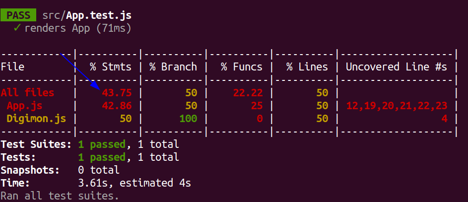
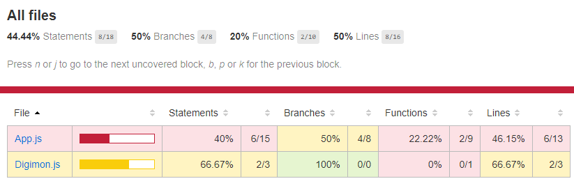

# (15.2) RTL - Mocks and Inputs

<br>

- **[Exercicios](#Exercicios)**

<hr>
<br>

## Resumo

#### Explicando teste adicionado em _*./mocking-tests/src/App-3.test.js*_:

```js
// App.test.js
import React from 'react';
import { render } from '@testing-library/react'
import App from './App';

afterEach(() => jest.clearAllMocks());

it('fetch joke', async () => {
  const joke = {
    id: '7h3oGtrOfxc',
    joke: 'Whiteboards ... are remarkable.',
    status: 200,
  };

  jest.spyOn(global, "fetch")
  global.fetch.mockResolvedValue({
    json: jest.fn().mockResolvedValue(joke),
  });

  const { findByText } = render(<App />);
  await findByText('Whiteboards ... are remarkable.');

  expect(global.fetch).toBeCalledTimes(1);
  expect(global.fetch).toBeCalledWith('https://icanhazdadjoke.com/', {"headers": {"Accept": "application/json"}});
});
```

Vamos em partes entender o que esta acontecendo:
- A constante `joke` cria um objeto similar ao que é retornado da `API`;

- O `jest.spyon` espiona as chamadas da `fetch` do objeto `global`, é por meio deste objeto `global` que conseguimos usar qualquer função do sistema, por exemplo a função `parseInt`, a função `fetch`, etc...

- Quando a função `fetch` for chamada, ao invés de fazer uma requisição à API externa, será chamado o nosso `mock`. Repare que, para cada `.then` utilizamos um `.mockResolvedValue` e simulamos o retorno que o `fetch` teria, primeiro retornamos um objeto que contem a função `.json` e dentro dela criamos um mock que retorna a nossa piada, satisfazendo o que é esperado no nosso componente;

- É importante termos o `async` em `it('fetch joke', async () => {` , para que se possa utilizar `await findByText` onde estamos dizendo ao nosso teste: **hei, espere até que consiga encontrar esse texto no dom ou dê erro por limite de tempo**;

- As funções `toBeCalledTimes` e `toBeCalledWith` servem para garantir respectivamente, o número de chamadas ao nosso `fetch` e que ele foi chamado com os argumentos corretos.

- A linha `afterEach(() => jest.clearAllMocks());` faz com que, após cada teste, nosso `mock` seja limpo, ou seja, no caso acima, garante que após o teste, o `fetch` não seja mais um mock, isso é bem útil para que não tenha interferência entre um teste e outro.

<br>

```js
import React from 'react';
import { render } from '@testing-library/react'
import App from './App';

afterEach(() => jest.clearAllMocks());

it('fetch joke', async () => {
  const joke = {
    id: '7h3oGtrOfxc',
    joke: 'Whiteboards ... are remarkable.',
    status: 200,
  };

  jest.spyOn(global, "fetch")
  global.fetch.mockResolvedValue({
    json: jest.fn().mockResolvedValue(joke),
  });

  const { findByText } = render(<App />);
  await findByText('Whiteboards ... are remarkable.');
  expect(global.fetch).toBeCalledTimes(1);
  expect(global.fetch).toBeCalledWith('https://icanhazdadjoke.com/', {"headers": {"Accept": "application/json"}});
});

```

O código acima (App-4.test.js) é muito similar ao do exemplo anterior (App-3.test.js), alterando somente o `mock`.

Nesse exemplo estamos dizendo que `global.fetch` agora é uma função mockada com `jest.fn`, que retorna uma `Promise`, e na primeira vez que ela for resolvida, deve retornar um objeto com uma outra função `json` que também é uma `Promise`, que quando resolvida retorna sua piada.

Outra forma de escrever o mesmo exemplo seria com a sintaxe `async/await`, onde temos o `mock` dessa forma:

```js
// Parte do código do arquivo ./App-5.test.js 

global.fetch = jest.fn(async () => ({
  json: async () => joke
}));
```

<br>

Utilizamos o `mock` para evitar uma chamada externa à API, tornando o nosso teste mais rápido e confiável, retornando o resultado contido na constante `joke`. 

Imagine que a API saia do ar ou que perdemos acesso à internet enquanto o teste roda. O teste quebraria, apesar do seu código estar funcionando. 

Mockar a chamada à API evita esse tipo de problema. Outro ponto é que seus testes vão rodar mais rápido se você não fizer uma chamada real à API todas as vezes que  for rodar algum teste.

<hr>
<br>

## Exercicios

Este repositório contém uma aplicação funcional, ela utiliza a **[Digimon API](https://digimon-api.herokuapp.com/)**.

É uma aplicação simples que pesquisa digimons pelo nome.
O objetivo nesse exercício é utilizar todos os aprendizados sobre testes até o momento para alcançar 100% de cobertura de testes.
Você pode verificar essa cobertura utilizando o comando `npm run test-coverage`, ele te retorna um relatório como o abaixo:



A seta azul mostra o local que deve estar com o valor de 100, o que indica a finalização do exercício com todas as linhas do código testadas.

<br>

### INSTRUÇÕES

- Ao rodar o comando `npm run test-coverage`, será gerada uma nova pasta na raiz do seu projeto chamada `coverage`, após criada, abra o arquivo `./coverage/lcov-report/index.html` usando a extensão **Live Server** do seu VSCode.



- Veja os detalhes sobre o quê a cobertura de testes está avaliando, clicando no link do arquivo:


- Utilize essa lista como referência para programar seus testes. Cubra todos as linhas destacadas para ter 100% de cobertura!

<br>

### TESTANDO OS TESTES

"Testar testes" pode parecer um conceito estranho, mas existem técnicas bastante engenhosas para isso. A que vamos usar aqui no nosso exercício baseia-se em inserir vários bugs nos arquivos do projeto e verificar se os testes que você programou continua rodando ou apontando as falhas. Caso eles (os testes) não percebam os bugs, significa que os seus testes estão acusando falsos positivos (ou negativos também), legal né?

Esses bugs são chamados de "mutantes", e a nossa missão aqui é eliminá-los! Você pode até pensar nisso como um joguinho, e para que possamos fazer tudo de forma controlada, vamos utilizar uma library chamada **[Stryker](https://stryker-mutator.io/)**.

O Stryker irá gerar os mutantes automaticamente de acordo com a configuração passada pra ele, geralmente num arquivo JS podendo também ser num `JSON`. Se você acessar a raiz do nosso exercício, encontrará o arquivo `stryker.conf.js`. Abra-o e dê uma espiada! Se você tiver curiosidade sobre como funcionam as configurações, poderá acessar seu repositório e ler o **[README](https://github.com/stryker-mutator/stryker-js/tree/master/packages/core#readme)**.

#### Como usar o Stryker?
Usar o Stryker é bastante fácil, basta rodar o comando `npx stryker run` nos projetos que têm ele configurado. Você pode também instalá-lo de forma global usando o comando `npm install -g stryker-cli`.
